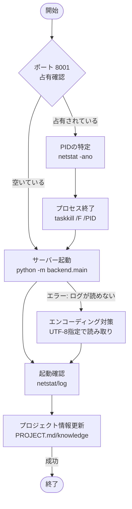

# バックエンドサーバー管理スキル

このスキルは、AIキャラクターストーリー生成システムのバックエンドサーバー（FastAPI）を確実かつ迅速に管理・再起動するための標準手順を定義します。

## 概要
バックエンドサーバーはポート `8001` で動作します。プロセスが正常に終了していない場合や、ポートが占有されている場合に、迅速に問題を特定して復旧させるための手順を含みます。

## サーバー管理フロー図



## 基本操作

### 1. サーバーの起動
以下のコマンドを使用して、モジュールモードで起動します。

```powershell
python -m backend.main
```

> [!TIP]
> 実行環境で `&&` が使えない場合は、代わりに `;` を使用してコマンドを連結してください。

> [!IMPORTANT]
> 必ずプロジェクトのルートディレクトリで実行してください。`backend/main.py` を直接実行すると、モジュールのインポートエラー（`ImportError`）が発生する可能性があります。

### 2. 状態の確認
サーバーが正常に起動し、ポート `8001` をリッスンしているか確認します。

```powershell
netstat -ano | findstr :8001
```

出力結果に `LISTENING` と表示され、プロセスID（PID）が表示されていれば正常です。

## トラブルシューティング

### ポート 8001 が既に占有されている場合
サーバー起動時に `[winerror 10048]` (Address already in use) が発生した場合は、以下の手順で既存プロセスを強制終了します。

1. **原因プロセスの特定**:
   ```powershell
   # ポート 8001 を使用している PID を特定
   netstat -ano | findstr LISTENING | findstr :8001
   ```

2. **プロセスの強制終了**:
   特定した PID（例: 63364）を以下のコマンドで終了させます。
   ```powershell
   taskkill /F /PID <PID>
   ```

3. **ゴーストプロセスの検索 (必要に応じて)**:
   `netstat` で見つからないが起動に失敗する場合、以下のコマンドで関連する Python プロセスを検索します。
   ```powershell
   Get-WmiObject Win32_Process | Where-Object { $_.CommandLine -like "*backend.main*" } | Select-Object ProcessId, CommandLine
   ```

### ログファイル（server_stdout.log）が読み取れない、または文字化けする場合
PowerShellのリダイレクト（`>`）によって作成されるファイルは、デフォルトで `UTF-16LE` になる場合があります。AIツールが読み取れない場合は、以下の方法で読み取ってください。

1. **PowerShellでエンコーディングを指定して読み取る**:
   ```powershell
   powershell -Command "Get-Content -Encoding UTF8 server_stdout.log"
   ```
2. **起動時にUTF-8で保存する（推奨）**:
   ```powershell
   python -m backend.main 2>&1 | Out-File -Encoding utf8 server_stdout.log
   ```

## 運用ルール
- サーバー再起動後は必ず `PROJECT.md` の起動情報を更新し、実行した手順をナレッジベース（`knowledge/fact/`）に記録してください。
- 作業完了後は必ず `git commit` と `git push` を行ってください。
