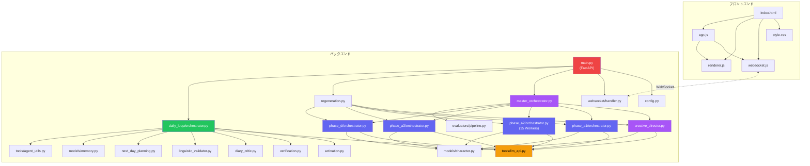

# AIキャラクターストーリー生成システム

> specification_v10.md と script_ai_app_specification_v2.md に基づく、心理学的人格モデルを搭載したキャラクターAI日記生成システム

---

## パート1: アプリシステム概要


### ディレクトリ・ファイル構成

```
AI_character_story_generater/
├── backend/
│   ├── main.py                                # FastAPI エントリポイント (WebSocket + REST API) ※2026-04-21 18:48 再起動完了 (PID: 2108)
│   ├── regeneration.py                        # アーティファクト個別再生成モジュール (依存マップ + 再生成コア)
│   ├── config.py                              # 設定管理 (APIキー, 4段階プロファイル, モデル定義)
│   ├── agents/
│   │   ├── creative_director/
│   │   │   └── director.py                    # Tier -1: Creative Director (5フェーズ, 2層自己批判, Web検索必須, file_read, 構成プリファレンス注入+[G]整合性チェック)
│   │   ├── master_orchestrator/
│   │   │   └── orchestrator.py                # Tier 0: Phase A-1→A-2→A-3→D 順次制御 + Evaluator統合 + concept_review一時停止 + cancel()中断機能
│   │   ├── phase_a1/
│   │   │   └── orchestrator.py                # Phase A-1: マクロプロフィール (8 Workers, 並列化)
│   │   ├── phase_a2/
│   │   │   └── orchestrator.py                # Phase A-2: ミクロパラメータ 52個 + 規範層 (15 Workers, v2 §6.4.2準拠)
│   │   ├── phase_a3/
│   │   │   └── orchestrator.py                # Phase A-3: 自伝的エピソード (エージェンティック, 2層自己批判)
│   │   ├── phase_d/
│   │   │   ├── orchestrator.py                # Phase D: 7日間イベント列 (Step5エージェンティック, 2層自己批判)
│   │   │   └── capabilities_agent.py          # CharacterCapabilitiesAgent (Web検索2回以上+批評+内省, エージェンティック化)
│   │   ├── daily_loop/
│   │   │   ├── orchestrator.py                # Day 1-7 日次ループ (RIM + 感情強度判定 + 内省 + 日記)
│   │   │   ├── activation.py                  # パラメータ動的活性化 (5-10個選択, v10 §3.5)
│   │   │   ├── verification.py                # 裏方出力検証 (#1-#52漏洩チェック, v10 §4.6b)
│   │   │   ├── checkers.py                    # 4つの個別チェックAI (Profile/Temperament/Personality/Values)
│   │   │   ├── diary_critic.py                # 日記Self-Critic (LLMベースのシンプルな品質チェック)
│   │   │   ├── linguistic_validator.py        # 言語表現バリデーター (LinguisticExpression全フィールド検証, Stage 22)
│   │   │   ├── third_party_reviewer.py        # 第三者視点の日記検証AI (読者体験品質チェック)
│   │   │   └── next_day_planning.py           # 翌日予定追加 (Stage1+2, protagonist_plan)
│   │   ├── context_descriptions.py            # コンテキスト説明付与ヘルパー (wrap_context, 全エージェント共通)
│   │   └── evaluators/
│   │       └── pipeline.py                    # Evaluator群7種 (SchemaValidator常時ON, LLM5種)
│   ├── models/
│   │   ├── character.py                       # Pydantic v2 データモデル (v2 §6.3.4準拠スキーマ + StoryCompositionPreferences)
│   │   └── memory.py                          # 記憶・ムード・イベント処理モデル
│   ├── tools/
│   │   ├── llm_api.py                         # LLM API統合ラッパー (Anthropic + Google AI Studio + フォールバック)
│   │   └── agent_utils.py                     # Worker検証 + Markdownセクションパーサー
│   ├── websocket/
│   │   └── handler.py                         # WebSocket接続管理 + 思考ストリーミング
│   ├── reference/                             # 心理学理論参考資料 (Creative Directorのfile_readツール対象)
│   └── storage/character_packages/            # 生成済みパッケージ保存先（1キャラ=1ディレクトリ）
│       └── {キャラ名}/
│           ├── package.json                   # 最終キャラクターパッケージ
│           ├── checkpoint.json                # 中断再開用チェックポイント
│           ├── 00_profile.md                  # 人間可読プロファイル
│           ├── agent_logs.json/.md            # エージェント思考ログ
│           ├── key_memories/day_NN.json       # key memory（7日間フル保持）
│           ├── short_term_memory/day_NN.json  # 短期記憶DB日単位スナップショット
│           ├── mood_states/day_NN.json        # ムード状態日単位スナップショット
│           ├── daily_logs/
│           │   ├── Day_N.md                   # 包括的MDアーカイブ（人間用）
│           │   └── day_NN/                    # 行動ログ日別フォルダ
│           ├── diaries/day_NN.md              # 日記本文
│           └── sessions/                      # 再生成・バージョン管理用
│               └── {session_id}/              # セッション別のログ/日記一式
├── frontend/
│   ├── index.html                             # メインUI (APIキー設定画面, 4画面構成, 構成プリファレンスUI, コンセプトレビュー画面)
│   ├── css/style.css                          # プレミアムダークテーマ (設定モーダル対応)
│   └── js/
│       ├── websocket.js                       # WebSocket接続管理 (自動再接続)
│       ├── renderer.js                        # データ → HTML レンダリング
│       ├── settings.js                        # APIキー管理 (localStorage 連携)
│       └── app.js                             # アプリケーションロジック (ペイロードへのキー付加)
├── .env.example                               # 環境変数テンプレート
├── requirements.txt                           # Python依存関係
├── specification_v10.md                       # コア仕様書 (v10)
└── script_ai_app_specification_v2.md          # 脚本AI仕様書 (v2)
```

### モジュール依存関係



> **凡例**: 🟣紫 = Tier -1/0 エージェント、🔵青 = Phase Orchestrators、🟢緑 = 日次ループ、🟡黄 = LLM API、🔴赤 = FastAPI

### プロジェクト要件

| 項目 | 内容 |
|---|---|
| **目的** | サード・インテリジェンス社 Bコースインターン選考課題 |
| **課題** | キャラクターAIに密教学（心理学的人格モデル）を教え、7日間の日記を生成する |
| **理想的最終形** | 1キャラクターの完全な脚本パッケージ（52パラメータ + マクロプロフィール + 自伝的エピソード + 7日間イベント列）を生成し、日次ループで7日間の日記を自動生成 |
| **対象ユーザー** | インターン選考の審査員 |
| **実装対象外** | クローリング（Phase B）、擬似体験（Phase C）、エコーチェンバー |

### 現在のシステム仕様・状態

#### コアロジック・ルール

**4層エージェント階層（Day 0）:**
1. **Tier -1 Creative Director** (Opus): Tool-Callingによる自律推敲ループ。search_web + file_read + request_critique + submit_final_concept の4ツール。Self-Critiqueチェックリスト [A]-[G] の7カテゴリ（[G]=ユーザー構成方針との整合性）。ユーザー指定の `StoryCompositionPreferences` をMarkdown形式でプロンプトに注入。
2. **Tier 0 Master Orchestrator** (Opus): Phase A-1→A-2→A-3→D順次制御。各Phase完了後にEvaluator-Optimizerループで即時評価・再生成。**Creative Director完了後にconcept_review一時停止**（asyncio.Event）でユーザーレビューを待機。approve/revise/edit の3アクション対応。**`cancel()`メソッドによる中断機能**（WebSocket `cancel_character_generation` アクション対応）。Phase Dには`set_master_orch()`で参照を渡し、キャンセル伝播。
3. **Phase Orchestrators**: 各Phase内のWorker群を管理。A-1=8 Workers+LinguisticExpressionWorker（9Worker合計、PhaseA1Result返却）、A-2=15 Workers（v2 §6.4.2準拠）、A-3=Planner(自然言語)+Writer(JSON一括)、D=4 Workers(自然言語)+EventWriter(JSON)。
4. **Workers**: プロファイル別モデル（high_quality=sonnet, draft=gemini）。最低ティア=Gemini 2.5 Pro。

**Phase A-2 Worker 15分割構成（v2 §6.4.2準拠）:**
```
Step 1: パラメータ Worker 10基を並列実行
  TemperamentWorker_A1 (情動反応系 #1-9)
  TemperamentWorker_A2 (活性・エネルギー系 #10-14)
  TemperamentWorker_A3 (社会的志向系 #15-18)
  TemperamentWorker_A4 (認知スタイル系 #19-23)
  PersonalityWorker_B1 (自己調整・目標追求系 #24-30)
  PersonalityWorker_B2 (対人・社会的態度系 #31-38)
  PersonalityWorker_B3 (経験への開放性系 #39-43)
  PersonalityWorker_B4 (自己概念・実存系 #44-48)
  PersonalityWorker_B5 (ライフスタイル・表出系 #49-50)
  SocialCognitionWorker (対他者認知 #51-52)
Step 2: 規範層 Worker 4基を並列実行
  ValuesWorker (Schwartz 19価値)
  MFTWorker (道徳基盤理論 6基盤)
  IdealOughtSelfWorker (理想自己/義務自己)
  GoalsDreamsWorker (長期・中期目標)
Step 3: CognitiveDerivation (ルールベース自動導出, LLM不使用)
```

**Human in the Loop（生成前 + 生成後）:**
```
【生成前】ユーザーが8カテゴリの物語構成プリファレンスを任意選択
  → StoryCompositionPreferences として WebSocket ペイロードに同梱
  → Creative Director のプロンプトにMarkdown形式で注入
  → Self-Critique [G] でユーザー構成方針との整合性を自動チェック

【生成後】Creative Director → [concept_review 一時停止] → ユーザーレビュー
  → 「承認して続行」: approve_concept → Phase A-1 へ
  → 「フィードバックして再生成」: revise_concept → Creative Director 再実行
  → 「直接編集」: edit_concept_direct → 編集済みJSONで続行
```

**物語構成プリファレンス `StoryCompositionPreferences`（8カテゴリ + 自由記述）:**
| カテゴリ | 選択肢数 | 理論的根拠 |
|---|---|---|
| 物語構造 (narrative_structure) | 12種 | Aristotle, Freytag, Campbell, Harmon, Snyder, 起承転結 |
| 感情トーン (emotional_tone) | 12種 | Ekman, Plutchik, McKee |
| キャラクターアーク (character_arc) | 8種 | Weiland, Vogler, Campbell |
| テーマの重さ (theme_weight) | 8種 | Booker, McKee |
| クライマックス構造 (climax_structure) | 8種 | Freytag, McKee, Field |
| ジャンル (genre) | 12種 | 文学ジャンル理論 |
| ペーシング (pacing) | 8種 | McKee, Field, Snyder |
| 語り口 (narrative_voice) | 10種 | Genette, Booth, Bakhtin |
| 自由記述 (free_notes) | - | ユーザー自由入力 |

**日次ループ（Day 1-7）:**
```
各日のイベント(2-4個) → 動的活性化(5-10パラメータ選択, マクロプロフィール+経験DB入力)
→ 衝動系エージェント(Perceiver+Impulsive統合, raw text出力)
→ 【感情強度判定】intensity=high → Reflectiveバイパス / それ以外 → Reflective実行(raw text出力)
→ 出力検証(#1-#52漏洩チェック, raw textベース)
→ 出来事周辺情報統合エージェント(Agentic: 行動決定+情景描写+ストーリー統合)
→ 【4つの個別チェックAI】Profile/Temperament/Personality/Values並列チェック
→ 価値観違反チェック
→ 内省(Self-Perception + 過去統合 + 再解釈, raw text出力)
→ 翌日予定追加(必須イベント化) ← Stage 19変更: 日記生成の前に実行
→ 日記生成: Agentic日記執筆(言語的表現方法[LinguisticExpression]全情報注入・check_diary_rules必須ゲート付き・submit時強制チェック)
→ 【4つの個別チェックAI】日記出力チェック
→ ムード更新(Peak-End Rule) → key memory抽出(個別ファイル保存) + 記憶圧縮
→ ムードcarry-over(減衰+閾値リセット)

※ 全エージェントにマクロプロフィール・世界設定・周囲人物・経験DB・key memoryを同梱
※ 統合エージェント・日記エージェントには所持品・能力・可能行動（CharacterCapabilities）も同梱（capabilities が存在する場合のみ）
※ エージェント出力はmarkdownパースせずraw textで次のエージェントへそのまま渡す
```

**出力形式の設計原則:**
| 出力の用途 | 形式 | 例 |
|-----------|------|-----|
| コードが機械的にパースしてPydanticモデルに格納する値 | JSON (`json_mode=True`) | パラメータID、Episode Writer全出力、WeeklyEventWriter全出力、Tool Calling |
| エージェント間でプロンプトコンテキストとして渡すもの | raw text（全文pass-through） | 衝動系エージェント出力、Reflective出力、内省メモ |
| 最終出力 | 自然な文章 | 日記、ナラティブ |

**隠蔽原則（implicit/explicit非対称）:**
- 衝動系エージェント（Perceiver+Impulsive統合）: 気質・性格層にアクセス可 / 規範層にアクセス不可
- Reflective Agent: 気質・性格層に隠蔽 / 規範層にアクセス可 / 衝動系出力をraw textで受け取る
- 日記生成AI: 気質・性格パラメータを知らない（行動からの推測のみ）

**品質プロファイル別モデル設定:**
| Profile | director_tier | worker_tier | Evaluator | retry回数 | 備考 |
|---------|--------------|-------------|-----------|-----------|------|
| high_quality | opus | sonnet | 全7種ON | 4 | 本番提出用 |
| standard | sonnet | sonnet | 5種ON | 3 | 推奨バランス |
| fast | sonnet | gemini | 3種ON | 2 | 素早い確認 |
| draft | sonnet | gemini | 2種ON | 2 | 最小コスト（最低ティア=Gemini 2.5 Pro → 2.0 Flash自動フォールバック） |

**Gemini 2段階フォールバック（`tier="gemini"`）:**
- 第1試行: Gemini 2.5 Pro（高品質、1000リクエスト/日の無料枠）
- 第2試行: クォータ超過（429 / ResourceExhausted）時 → Gemini 2.0 Flash（1500リクエスト/日の無料枠）
- Claude（opus/sonnet）からGeminiへのフォールバック時も同様の2段階フォールバックを適用

#### データモデル（v2 §6.3.4準拠拡張済）

| モデル | 用途 | Phase | 拡張フィールド |
|---|---|---|---|
| `ConceptPackage` | キャラクター概念設計 | Tier -1 | psychological_hints(want_and_need, ghost_wound, lie) |
| `GenerationStatus` | 生成プロセスの進捗管理（管理ボックス） | 全体 | 各フェーズ・ステップの完了フラグ、Phase Dの日次進捗 |
| `CharacterPackage` | 脚本パッケージ全体 | 全体 | `status: GenerationStatus` を内包 |
| `MacroProfile` | マクロプロフィール（9セクション） | A-1 | VoiceFingerprint拡張(二人称, 絵文字, 自問頻度, 比喩頻度)。voice_fingerprintは後方互換のため残存 |
| `LinguisticExpression` | 言語的表現方法（独立生成アイテム） | A-1 | SpeechCharacteristics(concrete_features+abstract_feel+conversation_style+emotional_expression_tendency) + DiaryWritingAtmosphere(tone+structure+introspection+written/omitted+atmosphere)。日記生成プロンプトにのみ注入 |
| `MicroParameters` | 52パラメータ + 規範層 | A-2 | 15 Worker対応サブモデル(SchwartzValuesOutput等) |
| `AutobiographicalEpisodes` | 自伝的エピソード（5-8個） | A-3 | McAdams 5カテゴリ + redemption bias対策 |
| `WeeklyEventsStore` | 7日間イベント列（14-28件） | D | 2軸メタデータ(known/unknown x expectedness) |
| `CharacterCapabilities` | 所持品・能力・可能行動（Phase D エージェンティック生成） | D | PossessedItem(name/description/always_carried/emotional_significance) × 5-10個、CharacterAbility(name/description/proficiency/origin) × 3-5個、AvailableAction(action/context/prerequisites) × 3-5個 |
| `CapabilitiesHints` | 所持品・能力の方向性ヒント（Creative Director設計） | Tier -1 | key_possessions_hint / core_abilities_hint / signature_actions_hint の3フィールド。ConceptPackageに内包。Phase D capabilities生成の起点として参照 |
| `MoodState` | PAD 3次元ムード | 日次ループ | Peak-End Rule + carry-over |
| `ShortTermMemoryDB` | 記憶（通常領域のみ、段階圧縮） | 日次ループ | LLM段階圧縮(400→200→80→20字) |
| `KeyMemoryStore` | key memory（個別ファイル管理、7日間フル保持） | 日次ループ | `key_memories/day_01.json`形式で保存 |
| `ShortTermMemoryStore` | 短期記憶DB日単位スナップショット永続化 | 日次ループ | `short_term_memory/day_01.json`形式、圧縮後の全状態を保持 |
| `MoodStateStore` | ムード状態日単位スナップショット永続化 | 日次ループ | `mood_states/day_01.json`形式、daily_mood+carry_over_moodを保持 |
| `EmotionIntensityResult` | 感情強度判定（low/medium/high） | 日次ループ | Impulsive後にJSON判定 |
| `CheckResult` | 4個別チェックAIの結果 | 日次ループ | passed/issues/severity |
| `EventPackage` | 1イベント処理結果 | 日次ループ | 全エージェント出力を包含 |

#### UI/UX

- **フェーズ構成の区分化**: Day 0 ダッシュボード（キャラクター設定結果確認画面）と Day 1-7（日記生成）のシミュレーションループを明確にUI分割。
- **生成進捗管理（管理ボックス）**: `GenerationStatus` モデルによる厳密な状態管理。各フェーズ（A1-3, D）および Phase D 内部の各ステップの完了をフラグで管理し、重複生成を構造的に防止。
- **4画面構成**: 起動 → 生成中（思考とフェーズトラッカー） → Day 0結果（6タブ・ダッシュボード） → 履歴
- **生成進行UI（Phase Tracker）**: 生成中画面にて、現在のパイプライン実行状態（Creative Director → A-1 → A-2 → A-3 → D）をステップ形式で可視化。
- **インライン日記生成とキャンセル機能**: 「日記」ダッシュボード内で、他画面に遷移せずインラインで思考ログと生成中の日記をリアルタイム表示。
- **エラー耐性と生成再開（Resume）**: Pydantic v2 の `field_validator` による自己修復 + 各Phase完了ごとのチェックポイント保存。
- **アーティファクト個別再生成・編集**: 各タブ（コンセプト/プロフィール/パラメータ/エピソード/イベント）に「再生成」「編集」ボタンを配置。加えて、初期画面の「破棄して再生成」ボタン（全データ喪失リスク）を撤廃し、「セクションごとに再生成」モーダルへ移行。再生成モーダルで自然言語指示を入力可能。編集モーダルでJSON直接編集・保存。下流カスケード再生成はオプトイン。
- **構成設定UI**: 7種のEvaluatorのON/OFFを独立切り替え可能。
- **WebSocket**: エージェント思考のリアルタイム表示。詳細進捗ハートビート。
- **コスト表示**: リアルタイムトークン消費・推定コスト表示。

#### データフロー・永続化仕様

- **1キャラ=1ディレクトリ原則**: 生成中・完了後を問わず、全データは `character_packages/{safe_name(キャラ名)}/` 配下に統一保存
- **インメモリ共有**: 処理途中の全オブジェクト構成はPydanticスキーマによってメモリ上に保たれる
- **ファイル永続化（日単位バージョン管理）**: 日次ループの各日終了時に以下を自動保存:
  - `short_term_memory/day_NN.json` — ShortTermMemoryDBスナップショット（normal_area + diary_store）
  - `mood_states/day_NN.json` — MoodState（daily_mood + carry_over_mood）
  - `key_memories/day_NN.json` — key memory（300字以内、圧縮対象外）
  - `daily_logs/Day_{N}.md` — 日次ログ（統合エージェント出力・ムード変遷・内省・日記・翌日予定。衝動/理性エージェント出力は除外）
  - `daily_logs/Day_{N}_rim_outputs.md` — 衝動/理性エージェント（Impulsive/Reflective）の生出力（デバッグ・分析用）
- **復元・再開**: DailyLoopOrchestrator初期化時に最新スナップショットを自動ロードし、保存済み日の翌日から再開
- **システム・アーティファクトの永続化**: エージェント自身が生成するメタデータ（実装計画、ウォークスルー、タスクリスト等）は、プロジェクト外のシステム領域に会話IDごとに保存される
  - 保存先: `C:\Users\mahim\.gemini\antigravity\brain\<conversation-id>\`
  - 対象: `implementation_plan.md`, `walkthrough.md`, `task.md` およびその履歴。
- **その他永続化ファイル**:
  - `package.json` — 最終キャラクターパッケージ（生成完了時）
  - `checkpoint.json` — Phase A-C中断再開用
  - `00_profile.md` — 人間可読プロファイル
  - `agent_logs.json/.md` — エージェント思考ログ

#### エッジケース・制約

- `source: "protagonist_plan"` は Phase D では1件も生成禁止（日次ループの翌日予定追加が唯一の経路）
- redemption bias対策: contamination/loss/ambivalent型が安易な救済で終わることを構造的に防止
- 予想外度分布制約: `low`（予定通り・日常）が各日の半分以上、`high`（強い驚き）は Day 5 以外で各日最大1件

---

## パート2: ベストプラクティス・設計進化

### 1. エージェント階層の設計と評価ループ

**(a) 当初設計**: 仕様書v2の4層階層を採用。評価(EvaluatorPipeline)はすべての生成が終わった最後にまとめて呼び出して成否をテストする想定。
**(b) 変更・根拠**: 全工程終了後のテストでは、例えばPhase A-1（マクロ）で不合格が出た場合、既に無駄に消費したPhase Dまでのトークン生成が全て破棄されるというコスト破壊の問題が存在した。
**(c) 採用プラクティス**: `MasterOrchestrator` の `run()` 内に「Evaluator-Optimizer ループ」を完全統合。各Phase完了直後に即座に評価を挟み、FailならそのPhaseだけを指定回数（最大4回）再生成させる堅牢な自律修正システムへ進化。

### 2. LLM API設計

**(a) 当初設計**: Claude Agent SDK使用を前提。
**(b) 変更・根拠**: SDK未確認のため、直接Anthropic APIおよびGoogle Generative AIに切替。
**(c) 採用プラクティス**: `call_llm()` 統一インターフェースで、実在する最新モデルID（`claude-opus-4-6`等）を直接指定。エラー時にはフォールバックルーティング（Anthropic → Gemini 2.5 Pro）が作動。モデルティアは3段階: opus / sonnet / gemini（Gemini 2.5 Pro）。

### 2b. Gemini 2.5 Proフォールバックの思考トークン対策

**(a) 当初設計**: Claudeと同じ`max_tokens`値をそのままGeminiへ渡していた。`system_prompt`はフォールバック時に`user_message`に文字列結合して渡していた。
**(b) 変更・根拠**: Gemini 2.5 Proは内部で「思考トークン」を使用し、`max_output_tokens`の予算を消費する。例えば`max_tokens=3000`の場合、思考だけで3000トークン全てを使い切り、実際の出力が0トークン（`finish_reason=MAX_TOKENS`）になる問題が発覚。また`system_prompt`を`user_message`に結合する方式ではGeminiの`system_instruction`機能が使われず、指示の分離が機能しなかった。
**(c) 採用プラクティス**: `call_google_ai()`でGemini 2.5 Pro検出時に`max_output_tokens`を自動的に4倍（最低16384）に拡張。全tier(opus/sonnet/gemini)のフォールバックで`system_prompt`を`call_google_ai`の`system_prompt`引数として正しく渡すよう修正。

### 3. 隠蔽原則の実装

**(a) 当初設計**: 各エージェントに渡すコンテキストを関数引数レベルで制御
**(b) 採用プラクティス**: 
- Impulsive Agent: 活性化された気質・性格パラメータを直接渡す
- Reflective Agent: 活性化された規範層のみ渡す（気質パラメータは渡さない）
- 日記生成AI: `linguistic_expression`（言語的表現方法）全情報を渡す（パラメータ値は一切渡さない）
- 検証エージェント: パラメータ名・ID (#1-#52) の漏洩をキーワード＋LLMで自動修正

### 4. コアAPI層の自律エージェント化 (Agentic Loops v10)

**(a) 当初設計**: Python側の固定化された順次・反復ループ構造。
**(b) 変更・根拠**: V10仕様書に基づく「真のエージェンティックな振る舞い」を実現するため。
**(c) 採用プラクティス**: Anthropic Tool Calling機能を統合した `call_llm_agentic` インフラを構築し、CreativeDirector、Integration Agent(行動決定)、DiaryGenerationAgentの3コアを Tool-using Autonomous Agent へ置換。全Agenticエージェントは `self.profile.worker_tier` に基づき Claude→Gemini自動フォールバック（try/except + `call_llm_agentic_gemini`）を実装。内部ツール（`simulate_action_consequences`等）のtierもプロファイル連動。

### 5. エージェント出力形式: JSON → 自然言語 → raw text pass-through

**(a) 当初設計**: 全エージェント出力を `json_mode=True` で JSON 形式に統一し、Pydantic モデルで直接パースしていた。
**(b) 第1次変更**: JSON→Markdown構造化。`parse_markdown_sections()`で`## セクション名`単位にパースし、Pydanticモデルのフィールドに分配。
**(c) 第2次変更・根拠**: Markdownパース方式では、LLMが生成したセクション（例:「生じた衝動」）がPydanticモデルに対応フィールドがない場合に捨てられていた。また、パース→再構成の往復が冗長であり、次のエージェントに渡す際にわざわざ分解して再結合する意味がなかった。
**(d) 採用プラクティス**: 
- **JSON維持**: DynamicActivation(パラメータID)、ValuesViolation(bool判定)、EmotionIntensity(判定)、Tool Calling(decision_package)
- **raw text pass-through**: 衝動系エージェント・Reflective・内省の出力はLLM出力の全文を`raw_text`フィールドに格納し、次のエージェントにそのまま渡す
- `ImpulsiveOutput`, `ReflectiveOutput`, `IntrospectionMemo`は全て`raw_text: str`の単一フィールドに簡素化
- `parse_markdown_sections()`はorchestrator.pyからは不要となり、import削除済み

### 6. Phase A-3/D: 不要なJSON依存の排除

**(a) 当初設計**: Phase D の全5ステップ（WorldContext, SupportingCharacters, NarrativeArc, ConflictIntensity, WeeklyEventWriter）および Phase A-3 の全ステップ（EpisodePlanner, 個別EpisodeWriter×N）を `json_mode=True` でJSON出力させ、全結果をJSONパースしていた。
**(b) 変更・根拠**: Phase D Step1-4およびA-3 Plannerの出力は次のLLMへのプロンプトコンテキストとしてしか使われず、機械的なパースは不要だった。Anthropic APIクレジット枯渇→Geminiフォールバック環境下で、Gemma 4 (31B)のJSON出力が致命的に不安定で113回のJSONパース失敗が発生し、エピソード・イベントが全く生成されなかった。根本原因は「プロンプトとして渡すだけのデータにJSON出力を強制していた」こと。
**(c) 採用プラクティス**:
- Phase D Step1-4: `json_mode` を完全撤廃。自然言語テキストで出力し、そのまま次ステップのコンテキストに渡す
- Phase D Step5 (WeeklyEventWriter): JSON維持（14-28件のEventモデルへ機械的格納が必要）
- Phase A-3 Planner: 自然言語テキスト出力に変更
- Phase A-3 Writer: 個別並列生成から全エピソード一括JSON生成に統合（LLM呼び出し回数削減: 1+N → 2回）
- `llm_api.py`: 4段階フォールバック付き`_extract_json()`ヘルパー追加。`call_llm()`にjson_mode失敗時の自動リトライ（最大3回）を実装
- draftプロファイル: `worker_tier`を`gemini`に統一（Gemma 4は完全廃止済み）
- **判断基準**: 「そのデータをコードが機械的にパースするか？」Yes → JSON、No → 自然言語

### 7. Phase A-2 Worker 細分化

**(a) 当初設計**: MVP段階では4つの統合Worker（気質全部、性格全部、対他者認知、規範層）で実行。
**(b) 変更・根拠**: v2 §6.4.2 で15 Workerへの分割が明確に規定。単一LLMが52パラメータを一度に生成するとコンテキスト負荷で品質が低下し、一部再生成も困難。
**(c) 採用プラクティス**: v10 §3.3のカテゴリ分類（A1-A4, B1-B5）に沿って10パラメータWorker + 4規範層Worker + 1ルールベース導出の計15 Workerに分割。Step 1(10並列) → Step 2(4並列) → Step 3(逐次) の3段階で実行。

### 8. フロントエンド状態管理: package_nameの一貫性

**(a) 当初設計**: `currentPackage._package_name` は履歴読み込み時（`loadPackage()`）のみで設定されていた。
**(b) 変更・根拠**: 新規キャラクター生成完了時（`onGenerationComplete()`）では `_package_name` がセットされず、直後の日記シミュレーション開始時に `'unknown'` がバックエンドに送信され「パッケージが見つかりません」エラーが発生していた。履歴経由でのみ日記生成が動作する状態だった。
**(c) 採用プラクティス**: `onGenerationComplete()` 内で `currentPackage._package_name = result.package_name` を設定し、生成フロー・履歴フロー両方で一貫して `_package_name` が保持されるよう修正。

### 9. 行動決定エージェント → 出来事周辺情報統合エージェントへの進化

**(a) 当初設計**: 行動決定エージェント(`_integration`)と情景描写エージェント(`_scene_narration`)を分離。統合エージェントは行動決定のみを担当し、別途の情景描写エージェントが場面を描写していた。
**(b) 変更・根拠**: 行動決定と情景描写は密接に関連しており、分離すると行動の文脈と場面描写の間に乖離が生じていた。また、出来事の周辺情報（場所・時間・雰囲気）や行動後の結果を一貫したストーリーとして統合する層が不在だった。
**(c) 採用プラクティス**: 「出来事周辺情報統合エージェント」として統合。1回のAgenticループで行動決定 + 周辺情報 + 情景描写 + 後日譚 + 主人公の動き + ストーリーセグメントを一括生成。`IntegrationOutput`モデルを6フィールド拡張（`surrounding_context`, `action_consequences`, `scene_description`, `aftermath`, `protagonist_movement`, `story_segment`）。

### 10. 感情強度による理性バイパスメカニズム

**(a) 当初設計**: Impulsive AgentとReflective Agentを常に並列実行し、統合エージェントが両方の出力を統合していた。
**(b) 変更・根拠**: 現実の人間心理では、感情が極端に高まった状態（パニック、激怒、歓喜の絶頂等）では理性的判断が介入できない。並列実行は計算効率は良いが、心理学的リアリティに欠けていた。
**(c) 採用プラクティス**: Impulsive Agent実行後に軽量な感情強度判定ステップ（`_evaluate_emotion_intensity`, tier=gemini, JSON出力）を追加。`intensity=high`の場合、Reflective Agentを完全スキップし、空のReflectiveOutputを統合エージェントに渡す。統合エージェント側は理性参照なしの旨をシステムプロンプトに明記。

### 11. 4つの個別チェックAI（整合性検証レイヤー）

**(a) 当初設計**: 出力検証は`OutputVerificationAgent`（パラメータ名漏洩チェック）のみ。行動・日記がキャラクター設定に忠実かの検証は暗黙的（LLMのプロンプト依存）。
**(b) 変更・根拠**: LLMはプロンプトだけでは設定忠実度を保証できない。特に長いAgenticループ内で、キャラクターの気質や性格から逸脱した行動が生成されるケースが存在した。
**(c) 採用プラクティス**: 4つの独立チェッカーを`checkers.py`に実装し、統合エージェント出力と日記出力の2箇所で並列実行:
  - `ProfileChecker`: マクロプロフィール（名前・職業・生活様式・人間関係）との整合性
  - `TemperamentChecker`: 活性化済み気質パラメータ（Cloningerモデル）との整合性
  - `PersonalityChecker`: 活性化済み性格パラメータ（Big Five/HEXACO）との整合性
  - `ValuesChecker`: 価値観（Schwartz・MFT・理想自己・義務自己）との整合性
  全チェッカーは裏方エージェント（隠蔽原則対象外）、tier=gemini（低コスト）、severity=majorのみログ警告。

### 12. key memoryの短期記憶からの分離

**(a) 当初設計**: `ShortTermMemoryDB.key_memories: list[KeyMemory]`としてインメモリの短期記憶DBの一部として管理。
**(b) 変更・根拠**: key memoryは段階圧縮の対象外（7日間フル保持）であり、短期記憶の通常領域（段階圧縮方式）とはライフサイクルが根本的に異なる。同一データ構造に混在させると管理上の複雑さが増す。
**(c) 採用プラクティス**: `KeyMemoryStore`クラスを新設し、`key_memories/day_01.json`形式で個別ファイルとして永続化。`ShortTermMemoryDB`からは`key_memories`フィールドを削除。`_build_memory_context()`では`KeyMemoryStore.load_all()`で読み込み、従来と同じコンテキスト形式を維持。

### 13. Geminiフォールバックの多層防御化

**(a) 当初設計**: `call_llm_agentic`(Claude)失敗時に`call_llm_agentic_gemini`へ単層フォールバック。Geminiフォールバック自体が失敗した場合のハンドリングは未実装。`_introspection()`はtier="sonnet"をハードコード。
**(b) 変更・根拠**: Claudeクレジット枯渇時にGeminiフォールバックが実行されても、Gemini側でもAPI障害やプロトコルエラーが発生しうる。フォールバックが無防備だと例外が日記生成全体をクラッシュさせていた。
**(c) 採用プラクティス**: 3層の防御を実装:
  1. Claude try/except → Gemini fallback try/except → デフォルト値フォールバック
  2. end-of-day処理の各ステップ（内省・日記・key memory・翌日予定）に個別try/except追加
  3. `_introspection()`のtierを`self.profile.worker_tier`に変更（プロファイル連動）

### 14. WebサーチおよびMDファイル保存ルーティング

**(a) 当初設計**: データ出力はJSONオブジェクトやインメモリ保持に留まっていた。
**(b) 変更・根拠**: 世界観に深みを持たせるリサーチ能力と、人間可読なMD永続化が必要。
**(c) 採用プラクティス**: 
- Creative Directorに `search_web` + `file_read`（backend/reference/参照）の2ツールを付与。
- `md_storage.py` で全エージェント出力・ムード変遷・内省・日記・key memoryを含む完全なDay_N.mdを自動生成。

### 15. Perceiver + Impulsive Agent統合 + 全エージェントへのコンテキスト拡充

**(a) 当初設計**: Perceiver(§4.3, 知覚フィルター)とImpulsive Agent(§4.6 Step 1, 衝動的反応)を独立した2つのエージェントとして順次実行。Perceiverは3フィールド出力（現象的記述・反射感情・自動注意）、Impulsiveは3フィールド出力（衝動的反応・身体感覚・行動傾向）。Perceiverにはマクロプロフィール(400文字制限)のみ渡し、経験DB・key memory・世界設定・周囲人物は未同梱。
**(b) 変更・根拠**: Perceiverのプロンプトを衝動系寄りに改変した結果、Impulsive Agentと役割が完全に重複。また、Perceiver出力に「生じた衝動」セクションを追加したがPydanticモデルに対応フィールドがなく出力が捨てられていた。エージェントへのコンテキストが不足しており、世界設定・周囲人物・経験DB・key memoryなしでは文脈に乏しい出力になっていた。
**(c) 採用プラクティス**:
  - `_perceiver()`を完全削除し`_impulsive()`に統合。処理フロー: `動的活性化 → 衝動系エージェント → 感情強度判定 → Reflective → 検証 → 統合`
  - `PerceiverOutput`を削除。`EventPackage`から`perceiver_output`フィールドも削除
  - 全エージェント（衝動系・Reflective・統合・内省・日記）に以下を同梱:
    - マクロプロフィール（全文、400文字制限撤廃）
    - 世界設定（`_build_world_context()` 新設）
    - 周囲人物（`_build_supporting_characters_context()` 新設）
    - 経験DB（自伝的エピソード）
    - key memory + 通常記憶
  - 検証エージェントもPerceiver不要のraw textベースに刷新

### 16. ストレージ統一と状態永続化（ShortTermMemoryDB・MoodState）

**(a) 当初設計**: `_finalize_character_generation()`は`{キャラ名}_{timestamp}`形式で新しいディレクトリを作成してpackage.jsonのみを保存。生成中のデータ（checkpoint, profile, logs）は`{キャラ名}/`に保存。結果として1キャラクターのデータが2ディレクトリに分裂。`ShortTermMemoryDB`（段階圧縮記憶）と`MoodState`（PAD 3次元ムード）はメモリ上のみで、プロセス終了時に消失していた。
**(b) 変更・根拠**: 1キャラ=1ディレクトリの原則が破れていた。また、日次ループが途中で失敗した場合、記憶とムードの進行状態が復元不可能で、Day 1からの全再実行が必要だった。KeyMemoryStoreは既に個別ファイル永続化されていたが、ShortTermMemoryDBとMoodStateは永続化層が欠落していた。
**(c) 採用プラクティス**:
  - `_finalize_character_generation()`を`safe_name(char_name)`ベースの統一パスに変更（タイムスタンプ付きディレクトリ廃止）
  - `ShortTermMemoryStore`: `short_term_memory/day_NN.json`形式で記憶圧縮完了後にスナップショット保存
  - `MoodStateStore`: `mood_states/day_NN.json`形式でcarry-over完了後にdaily_mood + carry_over_moodを保存
  - DailyLoopOrchestrator初期化時に最新スナップショットを自動ロードし、保存済み日の翌日から再開
  - KeyMemoryStoreと同一のファイル管理パターン（日単位バージョン管理、最新ファイル=現在状態）

### 17. Gemma 4完全廃止とGemini 2.5 Pro最低ティア統一

**(a) 当初設計**: 最低コストティアとしてGemma 4 (gemma-4-31b-it)を`tier="gemma"`で使用。`call_gemma()`関数がGemma 4とGemini 2.5 Proの両方をルーティングしていた。TokenTrackerにgemma専用カウンターを保持。
**(b) 変更・根拠**: Gemma 4はJSON出力が致命的に不安定（113回のパース失敗）で既に実質使用停止状態だった。コードベースにGemma 4パスが残存することで混乱と保守負担が発生。最低ティアはGemini 2.5 Proで十分な品質を確保できるため、Gemma 4を完全廃止。
**(c) 採用プラクティス**:
  - `LLMModels.GEMMA_4_MOE`定数を削除。ティア体系は3段階（opus / sonnet / gemini）に統一
  - `call_gemma()` → `call_google_ai()`にリネーム、デフォルトモデルをGemini 2.5 Proに変更
  - `_call_llm_once()`から`tier=="gemma"`ブロックを完全削除
  - 全エージェント・Worker・チェッカーの`tier="gemma"`デフォルトを`tier="gemini"`に一括変更
  - TokenTrackerからgemma専用カウンターを削除し、geminiカウンターに統合

### 18. パラメータ動的活性化エージェントへのマクロプロフィール・経験DB入力追加

**(a) 当初設計**: 活性化エージェントの入力は「全52パラメータカタログ（数値入り）+ 現在ムード + シーン記述」のみ。マクロプロフィールと自伝的エピソードは「動的活性化の対象外」として独立参照される設計だった。また、tierが`"gemma"`にハードコードされ、プロファイル連動していなかった。
**(b) 変更・根拠**: パラメータの活性化判断にはキャラクターの背景が不可欠。例えば「職場の昇進を断られた」シーンでは、キャラの夢のタイムライン・人間関係・過去の挫折体験を知らなければ、どのパラメータ（達成志向、自尊感情、怒り等）が発火すべきか正確に判断できない。
**(c) 採用プラクティス**:
  - `DynamicActivationAgent.__init__()`に`macro_profile`と`episodes`を追加
  - `_build_macro_summary()`: マクロプロフィールをコンパクト要約（名前・職業・価値観コア・夢・人間関係）
  - `_build_episodes_summary()`: 自伝的エピソードを`[時期/カテゴリ] 要約100字`形式で圧縮
  - `activate()`のLLMプロンプトに`【キャラクター背景】`と`【自伝的エピソード】`セクションを追加
  - システムプロンプトの抽出ルールに「キャラクターの背景・経歴・人間関係を考慮」する旨を明記
  - tier バグ修正: オーケストレータから`tier=self.profile.worker_tier`を渡すよう変更

### 19. Day1日記の世界観導入セクション・日記文字数統一・イベント数削減

**(a) 当初設計**: 日記生成は全日同一プロンプト（300-600字、世界観紹介なし）。Phase Dのイベント数は各日4-6件（合計28-42件）。翌日予定のstage2整合性チェックがNone返却時はイベント未挿入。
**(b) 変更・根拠**: Day1は物語の入口であり、読者が設定・世界観を理解するためのセクションが不可欠だった。日記文字数は約400字（500字以下）に統一し、読みやすさを優先。イベント数は2-4件に削減し、各イベントの描写密度と処理効率を向上。翌日予定が整合性チェック失敗でイベント化されないケースも排除。
**(c) 採用プラクティス**:
  - `_generate_diary()`にDay1条件分岐を追加: `day == 1`の場合、system_promptに世界観・自己紹介の特別指示を付加（主人公の声で自然に織り込む形式）
  - 日記文字数を全日統一: プロンプト「約400字（500字以下）」、diary_criticの上限を800→500に修正
  - Phase Dプロンプトを「各日2-4件、合計14-28件」に変更
  - 翌日予定にフォールバック実装: stage2がNone時にplans[0]から直接Event生成（source: "protagonist_plan"）
  - フォールバックEventの`time_slot`はpreferred_timeが有効なスロット名ならそのまま採用、不明なら"afternoon"

### 20. VoiceFingerprint → LinguisticExpression（言語的表現方法の独立化）

**(a) 当初設計**: キャラクターの喋り方・文体情報は`MacroProfile.voice_fingerprint`（VoiceFingerprint）としてマクロプロフィール内に埋め込み。Step 2の6並列Workerの1つ（VoiceWorker）が`concept_package + basic_info`のみから生成していた。出力は構造化された技術フィールド（一人称・口癖・文末表現・避ける語彙等）のみ。
**(b) 変更・根拠**: VoiceFingerprint は具体的な特徴リストに留まり、「この人はどんな雰囲気で喋るか」という抽象的なイメージや、「この人の日記はどんな空気感があるか」というトーン・構成傾向が欠落していた。また、生成時のコンテキストが不十分（concept+basic_infoのみ）で、キャラクターの社会的立場・価値観・秘密・人間関係が喋り方に反映されていなかった。
**(c) 採用プラクティス**:
  - `LinguisticExpression`をCharacterPackageのトップレベル独立フィールドとして新設
  - `SpeechCharacteristics`: 既存VoiceFingerprint(concrete_features) + abstract_feel(抽象的雰囲気) + conversation_style + emotional_expression_tendency
  - `DiaryWritingAtmosphere`: tone + structure_tendency + introspection_depth + what_gets_written + what_gets_omitted + raw_atmosphere_description
  - Phase A-1の実行フロー: Step 2からVoiceWorkerを除去（6→5並列）、Step 4(RelationshipNetwork)の後にStep 5として全Worker結果をコンテキストに持つLinguisticExpressionWorkerを順次実行
  - `PhaseA1Result`データクラスで`MacroProfile + LinguisticExpression`をセット返却
  - **データフロー制約**: LinguisticExpressionは日記生成プロンプトにのみ注入。Phase A-2/A-3/Dには一切渡さない
  - `MacroProfile.voice_fingerprint`は後方互換のため残存（concrete_featuresからコピー）
  - Daily Loop: `_build_voice_context()`を拡張し、abstract_feel + diary_writing_atmosphere全フィールドを日記生成プロンプトに注入

### 21. エピソード/イベント生成のエージェンティック化と2層自己批判メカニズム

**(a) 当初設計**: Phase A-3（エピソード生成）はPlannerとWriterの2回のone-shot `call_llm()`呼び出し。Phase D Step 5（イベント生成）も1回のone-shot `call_llm(json_mode=True)`。Creative Directorは既にエージェンティックだったが、Web検索回数に最低保証がなく、プロンプトの「複数回検索」指示に依存していた。
**(b) 変更・根拠**: one-shot生成では品質にばらつきがあり、McAdamsカテゴリ分布やRedemption Bias、イベントのメタデータ制約違反を自律的に修正する手段がなかった。また、外部批評（request_critique）がpassしても「まあいいか」で妥協している可能性があり、真に品質を確信するメカニズムが不在。Creative Directorのリサーチが浅く、1-2回の検索で済ませてドラフトに入るケースがあった。
**(c) 採用プラクティス**:
  - **2層自己批判メカニズム（全ループ共通）**: (1) `request_critique` — 別LLMインスタンスによる客観評価（verdict: pass/refine）、(2) `self_reflect` — 「本当にこれでいいのか？妥協していないか？」を自問（convinced: true/false）。両方passで初めて`submit_`ツールが解放される厳格なゲート
  - **Phase A-3**: Planner/Writerを統合した1つのエージェンティックループ。4ツール（draft_episodes → request_critique → self_reflect → submit_final_episodes）。draft時にcritique_passed/self_reflect_convincedをリセット。フォールバックとして従来の2ステップone-shotを保持
  - **Phase D Step 5**: Steps 1-4（コンテキスト生成）は現状維持。Step 5のみエージェンティック化。4ツール（draft_events → request_critique → self_reflect → submit_final_events）。draft_eventsは構造バリデーション内蔵（イベント数・分布・禁止source・expectedness分布）
  - **Creative Director強化**: `search_count`カウンターで検索回数追跡。`min_research_searches`（config.pyで設定: high_quality=5, standard=3, fast=2, draft=1）回未満では`request_critique`がBLOCKED。5フェーズ構造化（計画→リサーチ→ドラフト→外部批評→自己内省→提出）。`self_reflect`ツール追加（convincedでなければcritique_passedもリセット→再ドラフト）
  - **self_reflect失敗時のリセット**: convinced=falseが返ると`critique_passed`もFalseにリセットされ、再度ドラフト→critique→self_reflectのフルループが必要。中途半端な妥協を構造的に防止

### 22. アーティファクト個別再生成・編集機能

**(a) 当初設計**: 生成完了後のキャラクターパッケージは読み取り専用。変更したい場合は「破棄して再生成」で全フェーズ（Creative Director→A-1→A-2→A-3→D）を最初からやり直す以外に方法がなかった。
**(b) 変更・根拠**: ユーザーが1つのアーティファクト（例: エピソードだけ暗めにしたい）を修正するためだけに全体を再生成するのはコスト的にも時間的にも非効率。また、AI再生成時にユーザーの具体的な指示と元のアーティファクトをLLMに参照させることで、「改善」型の再生成が可能になる。
**(c) 採用プラクティス**:
  - `backend/regeneration.py`を新規作成: アーティファクト→フェーズマッピング(`ARTIFACT_TO_PHASE`)、依存関係マップ(`ARTIFACT_DEPENDENTS`)、再生成コア関数(`regenerate_artifact()`)を集約
  - **MasterOrchestratorバイパス**: 再生成は各フェーズオーケストレータを直接呼び出し、既存パイプラインに影響を与えない
  - **regeneration_context注入**: 全5オーケストレータ(CreativeDirector, PhaseA1-A3, PhaseD)に`regeneration_context: str | None`パラメータを追加。再生成時に元のアーティファクトJSON + ユーザー指示を含むコンテキスト文字列がLLMプロンプトに付加される
  - **Phase A-1の共同再生成**: macro_profileとlinguistic_expressionは同フェーズで生成されるため、どちらか一方の再生成で両方が更新される（UIで明示）
  - **WebSocket新アクション**: `regenerate_artifact`（AI再生成、カスケードオプション付き）、`save_artifact_edit`（手動JSON編集の保存、Pydanticバリデーション付き）
  - **フロントエンド**: 各タブにアクションバー（再生成/編集ボタン）、再生成モーダル（自然言語指示入力+下流カスケード警告+プログレス表示）、編集モーダル（JSONテキストエリア+バリデーションエラー表示）

### 23. 日記エージェント提出ガード強化（submit_final_diary 必須チェック）

**(a) 当初設計**: 日記エージェントは `check_diary_rules` → `submit_final_diary` の順でツールを呼ぶようプロンプトで指示していたが、プログラム的な強制はなかった。LLMが `check_diary_rules` をスキップして直接 `submit_final_diary` を呼ぶことが可能だった。また、`diary_critic` が None（voice_fingerprint 不在）の場合、`check_diary_rules` が無条件 SUCCESS を返しチェックが完全にバイパスされていた。
**(b) 変更・根拠**: プロンプト依存の制御はLLMの判断に左右されるため信頼性が不十分。提出物の品質ゲートは確定的（deterministic）であるべき。
**(c) 採用プラクティス**:
  - `check_passed` / `last_checked_draft` フラグによる状態管理を追加
  - `submit_final_diary` 内で `check_passed == False` または `last_checked_draft != final_diary_text` の場合、自動で `check_diary_rules` を強制実行。不合格なら提出拒否
  - `diary_critic` 不在時もオーケストレーター側で AI臭い語彙ブラックリスト（14語）＋ 文字数（200-500字）の最低限ルールベースチェックを実施
  - **設計原則**: エージェントの自律的な品質チェックはプロンプト指示 + プログラム的ガードの二重保証

### 24. diary_critic（日記Self-Critic）のLLMベース簡素化

**(a) 当初設計**: `DiarySelfCritic`はルールベースチェック群（`AI_SMELL_WORDS`ハードコードリスト14語、`_check_avoided_words`、`_check_ai_smell`、`_check_first_person`、文字数チェック200-500字）を先に実行し、違反があればLLMに修正済み日記（`corrected_diary`）を生成させる2段構成。コンストラクタには`VoiceFingerprint`のみ渡され、`MacroProfile`は参照不可。
**(b) 変更・根拠**: 検証AIが行うべきは「入力→照合→判定→フィードバック」のシンプルな構造であり、ルールベースの複雑化は不要。また、critic自身が日記を修正（`corrected_diary`生成）するのは責務の越境であり、修正は主エージェントが行うべき。ハードコードされたAI臭語彙リストはメンテナンスコストが高く、LLMに判断を委ねる方が柔軟。
**(c) 採用プラクティス**:
  - ルールベースチェック（`AI_SMELL_WORDS`定数、`_check_avoided_words`、`_check_ai_smell`、`_check_first_person`、文字数チェック）を全て削除
  - 1回のLLM呼び出しで全チェック（言語的指紋遵守、避ける語彙、AI臭さ、文量、ムードPAD整合性、キャラクター整合性）を実行
  - `corrected_diary`を廃止し、`{"passed": bool, "issues": list[str]}`のみ返却。修正は主エージェントに委譲
  - コンストラクタに`MacroProfile`を追加し、キャラクター基本情報（名前・年齢・職業・趣味・日常）を整合性チェック用にLLMへ渡す
  - `_build_check_context()`で言語的指紋+キャラクター情報を構造化テキストに変換しシステムプロンプトに注入
  - **設計原則**: 検証AIは「入力を受け取って判定を出すだけ」のシンプルな構造。ルールベースの複雑化やcritic自身による修正は行わない

### Stage 18: 第三者検証AI + コンテキスト説明付与

- **対象/機能**: 日記品質の多段チェック体制構築 + 全エージェントへのコンテキスト意図明示

- **(a) 元の設計**:
  - 日記チェックは `check_diary_rules`（言語的指紋）のみで、読者体験の品質は検証していなかった
  - 後段の4チェックAI（Profile/Temperament/Personality/Values）はパラメータ整合性チェックであり「読んで面白いか」は評価対象外
  - 各エージェントへのコンテキストは `【マクロプロフィール】\n{data}` のようにラベルだけで渡しており、何のためのデータか・どう使うべきかの説明がなかった
  - エージェントがコンテキストの意図を誤解し、不適切な使い方をするリスクがあった

- **(b) 変更と理由**:
  - `ThirdPartyReviewer`を新設: 「初見の読者」として日記を5観点（理解可能性・面白さ・内部整合性・自然さ・イベント整合）で評価
  - 日記agenticループを3段階ゲート化: `check_diary_rules` → `third_party_review` → `submit_final_diary`
  - `third_party_review`失敗時は`check_passed`もリセットし、修正後に両方やり直しを強制（修正で言語ルール違反が生じる可能性に対応）
  - `max_iterations`を6→10に拡張（新ツール追加による反復増に対応）
  - `context_descriptions.py`を新設: `wrap_context(section_name, data, agent_role)` でセクション × ロール別に (what/why/how) の3点説明を付与
  - 全6ファイル（daily_loop, phase_a1, a2, a3, d）のuser_messageを更新

- **(c) 採用したベストプラクティス**:

  - **多層チェック**: 「言語ルール遵守」「読者体験品質」「パラメータ整合」の3層で品質を担保。それぞれ異なる観点を持つ検証AIが独立してチェック
  - **コンテキスト意図明示**: エージェントに渡す全てのコンテキストに「何のデータか」「なぜ渡すか」「どう使うか」を明記する。これによりエージェントの判断精度が向上し、コンテキストの誤用を防ぐ
  - **ロール別説明**: 同じデータ（例: マクロプロフィール）でも、衝動系・理性系・日記生成系で使い方が異なるため、ロール別に説明を分岐

### Stage 21: Gemini 2.5 Proクォータ超過時の2段階フォールバック

**(a) 当初設計**: `tier="gemini"` は常に `Gemini 2.5 Pro` (`models/gemini-2.5-pro`) を呼び出す単一パス。Claude (opus/sonnet) が失敗した場合も `Gemini 2.5 Pro` への単層フォールバックのみ。フォールバック先が同じ Gemini 2.5 Pro のため、クォータが枯渇するとシステム全体が `ResourceExhausted (429)` で停止していた。

**(b) 変更・根拠**: Gemini 2.5 Pro の無料枠上限は 1000 リクエスト/日。複数キャラの生成実験や長時間のデイリーループでこの上限に達すると、フォールバック先が存在せず全エージェントがクラッシュしていた。Gemini 2.0 Flash は別クォータ（1500 リクエスト/日）を持ち、2.5 Pro と同じ `call_google_ai()` で呼び出せるため、自動切り替えが容易。

**(c) 採用プラクティス**:
- `LLMModels` に `GEMINI_2_0_FLASH = "models/gemini-2.0-flash"` を追加
- `_call_llm_once()` 内に `_call_gemini_with_flash_fallback()` ヘルパーを定義:
  - 第1試行: Gemini 2.5 Pro
  - `ResourceExhausted` / `429` / "quota" エラーを検出した場合のみ Gemini 2.0 Flash へ切り替え
  - その他のエラーはそのまま re-raise（無条件のフォールバックによる誤魔化しを防止）
- `tier="gemini"` の直接呼び出しと、Claude 失敗後のフォールバックの両方にこのヘルパーを適用
- **設計原則**: フォールバックチェーンはエラー種別を見て判断する。クォータエラーはフォールバック対象、APIエラーや内部エラーはそのまま伝播させる

### Stage 23: 各ステップごとのトークン消費コスト記録システム

**(a) 当初設計**: `TokenTracker` (llm_api.py) がセッション全体のトークン消費を累計集計し、キャラクター生成完了時に `token_tracker.summary()` でマスターオーケストレーターに返却。ユーザーは全体のコストは知ることができるが、「日記生成にいくらかかった」「内省フェーズにいくらかかった」といった生成物ごとのコスト分解がなかった。DailyLoopOrchestratorの途中段階でのコスト情報は一切記録されず、エージェントログ（agent_logs.json）も日記ループ実行時には更新されないため、「どのステップで何のコストがかかったか」が全く不透明だった。

**(b) 変更・根拠**: ユーザーは「毎回の生成で、トークン消費量（何ドルかかっているのか）をすべて記録するようにしてほしい」と要望。具体的には、各ステップ（内省・日記生成・key memory抽出など）の完了後に「このステップで入力N，出力M，コスト$X.XX」が記録され、daily_logs/Day_N.mdに表として表示される必要があった。これによりユーザーは最適化ターゲット（重いステップはどこか）を特定でき、APIコストの可視化と管理が可能になる。

**(c) 採用プラクティス**:
  - `TokenTracker` に2メソッドを追加:
    - `snapshot() -> dict`: 現在の累計トークン値（opus_input/output/cache_write/read、sonnet_input/output/cache_write/read、gemini_input/output、total_calls）をコピーして返す
    - `cost_since(snap: dict, label: str) -> dict`: スナップショット後の差分トークンを計算し、モデル別費用計算に基づいて推定コスト(USD)を算出。戻り値は `{label, input_tokens, output_tokens, cost_usd, detail}` の辞書
  - `DayProcessingState` に `cost_records: list[dict]` フィールドを追加。1日の処理中に各ステップ完了時に `cost_since()` で計算したコスト辞書が追加される
  - DailyLoopOrchestrator の主要ステップ6つで前後スナップショットを取得:
    - 内省フェーズ (L1716前後)
    - 翌日予定 (L1726前後, Day < 7の場合)
    - 日記生成 (L1775-1814の再試行ループ全体の前後)
    - key memory抽出 (L1827前後)
    - デイリーログ要約 (L1836前後)
    - Day完了後にWebSocket `send_cost_update(token_tracker.summary())` を呼び出し (L1887前後)
  - `save_daily_log()` (md_storage.py) の末尾に「## 6. コスト記録」セクションを追記:
    - テーブル形式で各ステップ行 (ステップ名 | 入力トークン | 出力トークン | 推定コスト)
    - Day全体の合計行 (Day N 合計 | 合計入力 | 合計出力 | 合計コスト)
  - **設計原則**: 各生成物完成時に「これまでのコスト」がスナップショットで「これからのコスト」と分離でき、生成物→コストの対応関係を明確化

### Stage 29: DailyLoopOrchestrator 重大破損の復元

**(a) 破損前の設計**: `daily_loop/orchestrator.py` は1894行の完全なファイルで、以下を含んでいた:
- 4つのインラインストレージクラス（KeyMemoryStore, ShortTermMemoryStore, MoodStateStore, DailyLogStore）
- 65行の詳細な日記生成プロンプト（言語的指紋、日記ルール、エージェンティック行動指針6ステップ）
- 日記ツール4種の完全なゲーティングロジック（check→validate→third_party→submit の順序強制、submit時の強制チェック）
- Day 1特別指示（世界観・設定紹介セクション）
- 内省プロンプトの各セクション詳細説明（自己推測3-4文、過去記録統合2-3文等）
- `_build_full_daily_log()`, `_llm_summarize()` メソッド
- `_create_daily_log_and_summarize()` の完全な忘却プロセス（3日以上前の再要約）
- Geminiフォールバック（日記生成）
- メインループのチェッカーフィードバック付き再生成ループ（統合出力・日記の両方）
- 日記生成user_messageの15セクション（マクロプロフィール、世界設定、出来事、内省、ムード、短期記憶、規範層、過去の日記、明日の予定、チェッカーフィードバック）

**(b) 破損と原因**: コミット `6eae012`（APIキー動的管理システム移行）でファイルが1894行→903行に激減。原因はファイル全体の書き換えにより以下が消失:
- 日記生成プロンプト: 65行→1行（`f"""あなたはキャラクター本人として日記を書くエージェントです。\n{voice}"""`）
- 日記user_message: 15セクション→2セクション（出来事とintrospectionのみ）
- ツールゲーティングロジック: 全消失（check→validate→third_partyの順序強制なし）
- submit_final_diary: 強制チェックロジック全消失
- Day 1特別指示: 全消失
- self.profile: 未定義のまま6箇所で参照（RuntimeError確定）
- EmotionIntensityResult: import漏れ
- 存在しないモジュールからのimport: `backend.models.story`, `backend.storage.memory_db` 等（ModuleNotFoundError確定）
- _build_full_daily_log, _llm_summarize: 全消失
- 忘却プロセス: 全消失
- Geminiフォールバック（日記）: 消失
- メインループのチェッカー再生成ループ: 消失
- トークンコスト記録: 消失

**(c) 復元方法**:
- `git checkout 2caa6f8 -- backend/agents/daily_loop/orchestrator.py` で破損前の完全なファイルを復元
- api_keys対応: `__init__`に`api_keys: Optional[dict] = None`パラメータ追加、全13箇所の`call_llm`/`call_llm_agentic`/`call_llm_agentic_gemini`呼び出しに`api_keys=self.api_keys`を追加
- capabilities context: `_build_capabilities_context()`メソッド追加（Stage 27から移植）、統合エージェントのsystem_promptに所持品・能力参照指示追加、統合エージェント・日記のuser_messageに`wrap_context('所持品・能力', ...)`追加
- **教訓**: ファイル全体の書き換え時は、行数差が大きい場合（特に半減以上）にdiffレビューを必須とすべき。APIキー追加のような横断的変更では、各メソッドへの引数追加にとどめ、既存ロジックを書き換えない

### Stage 31: CharacterCapabilitiesWorker をエージェントに昇格

**(a) 当初設計（Stage 27/28時点）**: `CHARACTER_CAPABILITIES_PROMPT` は Phase D Step 1-2 の並列 gather の中で WorldContext・SupportingCharacters と同時に呼ばれる単純な one-shot Worker だった。プロンプトを渡して JSON を返させるだけであり、設計品質の自律的な検証・改善のメカニズムは存在しなかった。

**(b) 変更・根拠**: 所持品・能力設計は「このキャラクター以外には持てないもの」を作るべき高品質タスクであり、one-shot JSON 生成では設計の濃密さが保証できない。特に
- 汎用アイテム（スマートフォン等）に感情的意味が付与されない
- 能力の origin がキャラクターの人生史と接続されない
- Creative Director の capabilities_hints がキャラクターの職業/世界観の文脈から具体化されない
という問題が構造的に内在していた。Creative Director や Phase A-3 と同様に、Web 検索による事前調査と多層の品質ゲートが必要と判断。

**(c) 採用プラクティス**:
- **`CharacterCapabilitiesAgent` クラスを新設** (`backend/agents/phase_d/capabilities_agent.py`)
- **5ツール構成**:
  1. `search_web` — キャラクターの職業・背景・世界観に関する Web 検索（最低2回必須、ブロックガード付き）
  2. `draft_capabilities` — 所持品・能力・可能行動のドラフト提出（search 2回未満はブロック、構造バリデーション内蔵）
  3. `request_critique` — 別 LLM（sonnet）による品質批評（5観点: 所持品密度/能力整合/行動有用性/キャラ固有性/具体性）
  4. `self_reflect` — 「感情的深み・固有性・行動の実用性」を自問する内省（critique pass 後のみ）
  5. `submit_final_capabilities` — critique + self_reflect 両方 pass 後のみ提出可
- **エージェンティック行動指針**: リサーチ(search_web ×2回以上) → ドラフト → 批評 → 内省 → 提出 の5フェーズ厳守
- **Phase D 統合**: Step 1-2 の gather から `caps_task` を除去し、Step 2.5 として `CharacterCapabilitiesAgent.run()` を独立実行
- **フォールバック**: エージェンティックループ失敗時は one-shot JSON 生成に切り替え（後方互換維持）
- **設計原則**: 「高品質タスクはエージェント化し、Web 検索による事前調査と多層品質ゲートで設計の密度を保証する」パターンを CharacterCapabilities にも適用。

### Stage 32: `_generate_diary` NameError修正 + linguistic_expression の user_message 明示注入

**(a) 当初の設計**: `_build_voice_context()` が `linguistic_expression` から構築した声の文脈（voice）は `system_prompt` の `【言語的指紋（厳守事項）】{voice}` セクションにのみ注入されていた。`user_message` には `linguistic_expression` に関連するコンテキストブロックが存在しなかった。また、`_generate_diary()` の user_message 構築箇所（line 1484）で `normative_context` と `protagonist_plan_note` が参照されていたが、これらの変数は別メソッド (`_integration()`, 約 line 802) で定義されており、`_generate_diary()` のローカルスコープには存在しなかった。

**(b) 変更・根拠**: 
- **NameError バグ**: Python のスコープルール上、クラスメソッド間でローカル変数は共有されない。`normative_context` と `protagonist_plan_note` は `_generate_diary()` 内で未定義のため、日記生成実行時に必ず `NameError` が発生していた。
- **言語的表現データの伝達不足**: `system_prompt` への注入だけでは、特に Gemini フォールバック環境下や長い system_prompt でデータが希薄化するリスクがあった。`LinguisticExpressionWorker` が精密に設計した書き方設定（一人称・口癖・日記トーン・空気感等）を、日記生成 AI が確実に参照できるよう user_message にも明示的に渡す必要があった。

**(c) 採用プラクティス**:
- **NameError 解消**: `_generate_diary()` の冒頭（voice/event_summaries 定義直後）に `normative_context` と `protagonist_plan_note` を明示的に定義。`normative_context` は `self.package.micro_parameters` が存在する場合に `ideal_self` と `ought_self` から構築。`protagonist_plan_note` は日記コンテキストでは不要なため空文字で定義。
- **言語的表現の user_message 明示注入**: `voice_section = wrap_context('言語的表現方法（最重要 — 必ず守ること）', voice, 'diary')` を user_message のコンテキストブロックに追加（voice が空でない場合のみ）。これにより system_prompt と user_message の両方に言語的表現データが存在し、二重の確実な参照が保証される。
- **設計原則**: 「キャラクターの言語的指紋は system_prompt（行動規範として）と user_message（参照すべきコンテキストとして）の双方に注入し、どちらの経路でも確実に参照可能にする」。

### Stage 28: Creative Director への CapabilitiesHints 追加

**(a) 当初設計**: Stage 27 で CharacterCapabilities を Phase D で生成する際、方向性の起点は `concept_package` の JSON 全体とマクロプロフィールのみ。Creative Director は `psychological_hints`（気質・価値観の方向性）を出力していたが、「どんな所持品・能力が必要か」という capabilities の方向性ヒントは一切出力していなかった。Phase D の capabilities ワーカーは全コンテキストから暗黙的に推論するしかなく、Creative Director の意図が十分に反映されるかが不確実だった。

**(b) 変更・根拠**: Creative Director はキャラクターの Want/Need/Ghost 構造を最も深く理解している立場であり、「この人物が持ち歩くべきもの」「物語に重要な能力」「固有の行動パターン」についての方向性を明示的に設計できる。暗黙的な推論よりも、Creative Director が明示的に `capabilities_hints` を設計し Phase D がそれを起点とする方が、物語整合性の高い所持品・能力が生成される。

**(c) 採用プラクティス**:
- **`CapabilitiesHints` モデル新設** (`backend/models/character.py`): `key_possessions_hint`（所持品の方向性）、`core_abilities_hint`（能力の方向性）、`signature_actions_hint`（行動パターンの方向性）の3フィールド。`ConceptPackage.capabilities_hints` として後方互換フィールドで追加（デフォルト空）。
- **Creative Director 出力スキーマ更新** (`director.py`): SYSTEM_PROMPT の JSON 出力に `capabilities_hints` セクションを追加。各フィールドに「物語や感情的意味と接続するものを含める」等の設計指示を付記。
- **批評チェックリスト更新**: SELF_CRITIQUE_PROMPT の [F] 実装可能性チェックに「capabilities_hints の3フィールドがキャラクターの職業・価値観・want と整合しているか」を追加。
- **Phase D への明示的注入** (`phase_d/orchestrator.py`): `_full_context()` 内で `capabilities_hints` が存在する場合に専用テキストセクション（`【Creative Director capabilities_hints】`）としてコンテキストに追加。`CHARACTER_CAPABILITIES_PROMPT` の冒頭に hints を起点として参照する旨の指示を追加。
- **設計原則**: Creative Director → Phase D への情報連鎖を psychological_hints と同様のパターンで capabilities にも拡張。上位設計者の意図が下位ワーカーに明示的に伝達される構造を維持。

### Stage 27: CharacterCapabilities（所持品・能力・可能行動）の追加

**(a) 当初設計**: Phase D は WorldContext・SupportingCharacters の2タスクを並列生成するのみで、キャラクターが「実際に何を持っているか」「何ができるか」「何をとれるか」という具体的な情報を一切生成・保持していなかった。行動決定エージェント・日記生成エージェントは、マクロプロフィールや自伝的エピソードを参照して行動を決定していたが、所持品・道具・スキルへの参照は不可能だった。

**(b) 変更・根拠**: 行動決定の具体性を高めるためには、キャラクターが実際に手元に持つ道具・身につけているスキル・取れる行動の選択肢をエージェントが参照できる必要があった。例えば「手帳を持ち歩く記者キャラ」が「その場でメモをとる」という具体的な行動を取るには、所持品・能力の参照が不可欠。また、情景描写でも所持品が自然に登場することで描写の密度が増す。

**(c) 採用プラクティス**:
- **4モデル追加** (`backend/models/character.py`): `PossessedItem`（所持品）、`CharacterAbility`（能力）、`AvailableAction`（可能行動）、`CharacterCapabilities`（3つを統合するコンテナ）。`CharacterPackage.character_capabilities: Optional[CharacterCapabilities]` として後方互換フィールドを追加。
- **Phase D 並列生成追加** (`phase_d/orchestrator.py`): Step 1-2 の並列 gather に `caps_task`（`CHARACTER_CAPABILITIES_PROMPT`、json_mode=True）を3つ目として追加。結果を `PossessedItem/CharacterAbility/AvailableAction` へパースし `self.character_capabilities` に格納。`upstream_context`（WeeklyEventWriter へのコンテキスト）にも capabilities テキストを追加し、イベント生成時に所持品・能力を参照可能に。
- **Master Orchestrator保存** (`master_orchestrator/orchestrator.py`): `_execute_phase_with_retry` 内で `self._last_orch = orch` を設定し、Phase D 完了後に `self.package.character_capabilities = self._last_orch.character_capabilities` でパッケージに格納。
- **Daily Loop への投入** (`daily_loop/orchestrator.py`): `_build_capabilities_context()` メソッドを新設（所持品・能力・行動をテキスト化）。`_integration()` の user_message に `wrap_context('所持品・能力', ..., 'integration')` を追加、`_generate_diary()` の user_message にも `wrap_context('所持品・能力', ..., 'diary')` を追加（両方とも capabilities が存在しない場合はスキップ）。
- **MD 出力** (`md_storage.py`): `save_character_profile()` に「## 4.5. 所持品・能力・可能行動」セクションを追加（Episodes と Events の間）。所持品・能力・行動の3サブセクションを個別に出力。
- **コンテキスト説明追加** (`context_descriptions.py`): 「所持品・能力」キーに default/integration/diary の3ロール説明（what/why/how）を追加。
- **後方互換**: `character_capabilities: Optional[CharacterCapabilities] = None` のため、既存チェックポイントをロードしても None で正常動作。

### Stage 24: Opusエージェントのフォールバック先をGemini 3.1 Proに更新

**(a) 当初設計**: `_call_llm_once()` で `tier="opus"` または `tier="sonnet"` のどちらでも失敗時に同じ `_call_gemini_with_flash_fallback()` ヘルパーを呼び出す。このヘルパーは **常に** `LLMModels.GEMINI_2_5_PRO` でGeminiを試行していた。つまり、高品質な Opus エージェントが失敗した場合も、低コストな Sonnet エージェントが失敗した場合も、同じ Gemini 2.5 Pro へフォールバックしていた。

**(b) 変更・根拠**: Gemini 2.5 Pro から Gemini 3.1 Pro がリリースされ、より高性能・高品質となった。Opus エージェント（高品質ティア）が Claude で失敗した場合、フォールバック先も高性能な Gemini 3.1 Pro にすることで、品質損失を最小化できると判断。一方、Sonnet エージェント（低コストティア）のフォールバックは既に Gemini 2.5 Pro で十分な性能をもつため、コスト・パフォーマンスのバランスから変更不要。また `tier="gemini"` の直接呼び出し（最低コストティア）も Gemini 2.5 Pro のまま維持。

**(c) 採用プラクティス**:
- `LLMModels` に新定数 `GEMINI_3_1_PRO = "models/gemini-3.1-pro"` を追加
- `_call_gemini_with_flash_fallback()` 関数シグネチャに `gemini_model: Optional[str] = None` パラメータを追加
  - デフォルトは `LLMModels.GEMINI_2_5_PRO`（Sonnet/Gemini tier用）
  - 関数内で `if gemini_model is None: gemini_model = LLMModels.GEMINI_2_5_PRO`
- Opus 失敗時のフォールバック呼び出し（行 431-440）で `gemini_model=LLMModels.GEMINI_3_1_PRO` を指定
  - ```python
    gemini_model = LLMModels.GEMINI_3_1_PRO if tier == "opus" else None
    return await _call_gemini_with_flash_fallback(
        ...,
        gemini_model=gemini_model,
    )
    ```
- ログメッセージも動的化：`f"[call_llm] {gemini_model} quota exceeded. Falling back to Gemini 2.0 Flash."` で実際のモデル名を出力
- **設計原則**: フォールバック先をティア別に差別化し、各ティアの品質要求に応じた最適なモデルを割り当てる。コスト・品質のバランスを階層化する

### Stage 20: セーブポイント二重保存・中断再開の確実化

- **対象/機能**: キャラクター生成チェックポイントのロールバック問題修正、日記ループのpackage.json永続化

- **(a) 元の設計**:
  - `MasterOrchestrator._checkpoint()`は保存先名を1つだけ選択: Phase A-1完了前はSID名（例: `SID_20260412_023236`）、A-1完了後はキャラ名（例: `唐繰 ポポ`）。SIDフォルダのチェックポイントはA-1以降で二度と更新されなかった
  - 日記ループ（DailyLoopOrchestrator）では各Day完了後に `short_term_memory/`, `mood_states/`, `key_memories/` は保存されていたが、`package.json` は更新されなかった
  - `protagonist_plan`として翌日に追加されたイベント（`weekly_events_store.events`への`append`）はメモリ上だけに存在し、中断後の再開時に消滅していた

- **(b) 変更と理由**:
  - **ロールバック発生メカニズム**: ユーザーがSID名（セッション開始時にUIに表示される名前）でレジュームすると、SIDフォルダのチェックポイント（A-1完了前の初期状態）が読み込まれ、Phase A-1から再生成が始まる。「ミクロプロフィールやイベントの途中まで生成できていたとしても最初のマクロプロフィール生成まで戻る」という現象の根本原因
  - **日記ループの再開不整合**: `package.json`未更新により、再開時には翌日予定イベントが消えたオリジナルのイベントリストが読み込まれ、以降のDay処理でイベント不足が生じる

- **(c) 採用したベストプラクティス**:
  - **`_checkpoint()` 二重保存**: SID名フォルダに**常に保存**（どのフェーズでも）し、キャラ名が判明している場合はキャラ名フォルダにも**追加保存**。SID・キャラ名どちらでレジュームしても常に最新状態を取得可能に
  - **DailyLoopOrchestrator 各Day完了後にpackage.json更新**: `run()`の各Dayループ末尾で `package.json` を書き出し。protagonist_planイベントを含む最新状態を即時永続化
  - **run_diary_generation 完了後にpackage.json保存**: ループ完了後にも最終状態を `package.json` に書き出し、完全性を保証
  - **設計原則**: チェックポイントは「どの名前でアクセスされても最新状態が得られる」ことを保証する。保存コストは2倍だが、レジューム失敗のコスト（全再生成）と比較すれば圧倒的に有利

### Stage 19: デイリーログ要約・記憶システム再設計

- **対象/機能**: 短期記憶データベースの再設計、翌日予定AIの実行順序変更、日記の独立DB化

- **(a) 元の設計**:
  - **実行順序**: 内省→日記生成→ムード更新→key memory→記憶圧縮→翌日予定→ムードcarry-over。翌日予定AIは日記生成の後に動作しており、日記の中で「明日はこうしたい」という意向を反映できなかった
  - **短期記憶ソース**: `normal_area`のソースは日記テキスト（`diary.content`）であり、行動ログの要約ではなかった
  - **記憶圧縮**: `_compress_memories()`は `one_day_ago`で圧縮なし、`two_days_ago`でLLM 2/3圧縮（>200字のみ）、`three_plus_days_ago`で200字文字列切り捨て。実データではDay7時点でDay1が200字残存（仕様では20-30字であるべき）
  - **デイリーログ**: `daily_logs/Day_N.md`は22-32KBの包括的マークダウンアーカイブ（人間用）であり、エージェントへの短期記憶としては使用されていなかった
  - **日記の扱い**: `diary_store`に全日分の日記テキストを蓄積し、`_build_memory_context()`で`normal_area`と一緒に渡していた（日記とデイリーログの区別なし）

- **(b) 変更と理由**:
  - **翌日予定を日記の前に移動**: 内省→**翌日予定**→日記生成の順に変更。翌日予定AIの入力を`diary`→`events`（EventPackageリスト）に変更。日記プロンプトに「明日の予定」セクションを追加し、キャラクターが日記の中で翌日への意向・期待・不安を自然に表現可能に
  - **DailyLogStore新設**: 行動ログを日別フォルダ（`daily_logs/day_01/001_full.json`, `002_summary.json`...）で管理。エージェントには各日の**最新IDファイルを全て個別に**渡す
  - **LLMベース段階的要約**: 日記生成の後に`_create_daily_log_and_summarize()`を実行。当日の全行動ログを半分に要約し、3日以上前の過去日はさらに再要約（忘却プロセス）
  - **日記を独立DBとして分離**: `diaries/`フォルダから読み込み、「過去の日記です。参照し、言及すべき点があれば自然に触れてください」という指示付きで渡す
  - **`_build_memory_context()`を再構築**: key memory + デイリーログ最新版を「短期記憶（最重要）」として渡し、過去の日記は`_build_past_diary_context()`で「参照用」として分離

- **(c) 採用したベストプラクティス**:
  - **記憶階層の明確化**: 「短期記憶（最重要）」= デイリーログ要約 + key memory、「過去の日記（参照用）」= 独立DB。エージェントに渡す際に重要度を明示
  - **段階的忘却**: 毎日約半分に圧縮し、古い日ほどさらに再要約する自然な忘却プロセス。LLMが意味的に重要な部分を残すため、単純な文字列切り捨てよりも質が高い
  - **翌日予定の先行生成**: 計画→日記の順にすることで、日記が「振り返り + 明日への展望」という自然な構造になる
  - **フォルダ内バージョン管理**: 各日のフォルダに001, 002, 003...とバージョンを蓄積し、最新IDファイルが常にエージェントに渡される短期記憶。過去のバージョンも保持されるため追跡可能

### 22. 言語表現の完全活用と詳細バリデーション

- **(a) 当初設計**: Phase A-1の LinguisticExpressionWorker で「一人称」「口癖」「文末表現」「漢字ひらがな傾向」「避ける語彙」「喋り方の雰囲気」「会話スタイル」「感情表現傾向」「日記のトーン」「日記の構成傾向」「内省の深さ」「書く/省略する内容」「日記の空気感」といった13個の詳細な言語表現情報を生成していた。ただしこれらの全てが日記生成時に活用されていなかった。

- **(b) 変更・根拠**: LinguisticExpression の構造定義には「二人称の使い分け（親しい人/目上/知らない人）」「絵文字・記号の使用傾向」「自問形式の頻度」「比喩・反語の頻度」という4つのフィールドが存在したにもかかわらず、`_build_voice_context()`メソッドでは前者の9項目だけを構築していた。つまり生成された言語表現設定の70%しか日記プロンプトに渡されておらず、キャラクターの言語特性が十分に反映されていなかった。また、日記ドラフト提出時に「言語ルール（check_diary_rules）→ 第三者視点（third_party_review）」の2段階ゲートだけで、LinguisticExpression の細かい要素（絵文字使用傾向、自問頻度など）までは検証されていなかった。

- **(c) 採用したベストプラクティス**:
  - **完全な言語表現伝播**: `_build_voice_context()`を拡張し、二人称・絵文字・自問頻度・比喩頻度を含む全13項目をテキスト形式で構造化して日記システムプロンプトに注入。これにより LinguisticExpression 情報が100%活用される
  - **言語表現バリデーション層の追加**: `LinguisticExpressionValidator`クラスを新設。日記テキストが以下を守っているか詳細に検証: 一人称の統一、避ける語彙の有無、口癖の自然な出現、文末表現のバリエーション、漢字ひらがな傾向、絵文字使用傾向、自問形式の頻度、比喩・反語の頻度、日記のトーン、内省の深さ
  - **3段階ゲート化**: 日記提出フロー を「check_diary_rules（基本的な言語ルール） → validate_linguistic_expression（詳細な言語表現） → third_party_review（読み物としての品質）」の3段階に。第2段階で細かい言語特性の遵守を厳密に検証し、修正アドバイスを返す

### Stage 33: 履歴ロード時の日記データの統合表示とUIプログレス状態の修正

- **(a) 当初設計**: 
  - メニューパネルから「生成済みパッケージ」をロードする関数（`frontend/api/get_package`, frontend `loadPackage`）は、パッケージJSONとキャラクターデータしかロードしておらず、日記の内容は読み込まれていなかった。その結果、日記が既に生成されているのに、「日記」タブを開くと空状態（「日記シミュレーションを開始する」ボタン）が再度表示されてしまい、処理が未完了に見えていた。
  - フロントエンドでの進行状態表示において、日記生成が完了した際に流れる `diary_complete` 等専用フェーズイベントが正しく表示UI要素と連携していなかったため、「日記シミュレーション進行中...」のテキストが終了後もスタックして残っていた。

- **(b) 変更・根拠**: 
  - ユーザーから見て「終わったはずの作業が未完了になっている」と感じさせるのは、作業プロセスや信頼性を大きく損なうUX上の致命的な欠陥。
  - バックエンドとフロントエンドが共通のデータステートメントを持たず、サブディレクトリ（`diaries/`）内の保存ファイルに対する読み込みルーチンが存在しなかったため、履歴から完全なデータを復元する要件を満たせていなかった。

- **(c) 採用したベストプラクティス**:
  - **バックエンドAPIのレスポンス統合**: `main.py`の`get_package`（APIルート）を拡張し、`package.json`を取得する際にサブディレクトリ`diaries/day_*.md`も走査して読み込み、すべて`diaries`配列としてレスポンスに統合して返すように変更。
  - **フロントエンドのステート復元**: `app.js`の`loadPackage`内で、取得した`currentPackage.diaries`が存在すれば、即座に`Renderer.renderDiary`を使ってレンダリング。同時に、初期の開始パネル（`diary-start-panel`）およびシミュレーション進捗領域（`diary-generation-area`）を非表示化することで、ユーザーに完全に完了した状態をシームレスに提示する構造を確立。
  - **プログレス管理の分離と精密化**: `app.js`の`updateProgress`で、接頭辞が`diary_`で始まるフェーズ（`diary_init`や`diary_complete`等）向けのDOM操作ロジックを独立分離。完了時に進行中テキストを確実かつ明示的に「日記の生成が完了しました」に書き換えることでスタックを防止。
  - **スコアリング**: バリデーター は「0.0～1.0の品質スコア」と「どの項目が守られていたか/守られていなかったか」を明示する。これにより品質の可視化と段階的改善が可能

### Stage 45: 日記再生成機能の刷新（セッションベースのバージョン管理導入）

**(a) 当初設計**: 日記の再生成時、既存の進行状態（記憶やムード推移）を一度物理的に削除（`shutil.rmtree`）してから Day 1 から生成し直す破壊的な再起動ロジックを採用していた。また、日記データを `CharacterPackage` モデル内に重複して保持させようとしたため、単一ファイル（package.json）が巨大化し、ディレクトリ内の `.md` ファイルとの同期不整合が発生するリスクがあった。

**(b) 変更・根拠**: ユーザーが「昨日の日記をやり直したい」と考えたとき、以前の生成結果も比較対象として残しておく方が物語の探索において安全で有益である。物理削除は復旧不可能であり、エラー発生時に全データが消失するリスクが高い。そのため、生成ごとにユニークな `session_id` を付与し、独立したフォルダ構造で管理する非破壊的な「セッション管理方式」に刷新した。

**(c) 採用プラクティス**:
- **セッションフォルダの自動生成**: `storage/<char>/sessions/<session_id>/` 配下に日記、ログ、ムード、記憶を完全に分離して保存。`session_id` はタイムスタンプを含み、一意性を保証。
- **オンデマンド・マージ読み込み**: `get_package` API において、ファイルシステム上の `sessions/` を走査し、最新のセッションデータを動的にパッケージJSONに結合して返す。モデル側に巨大なデータを保持させる必要がなくなり、情報の鮮度と整合性を両立。
- **ストアクラスのセッション対応**: `KeyMemoryStore`, `DailyLogStore` 等が `session_id` を受け取り、動的にパスを切り替えるよう抽象化層を拡張。
- **冗長な同期の排除**: ファイルシステムを唯一の真実のソース (Single Source of Truth) とし、モデル側への不要なデータの書き戻し（`diaries` フィールド等）を廃止。
- **設計原則**: 「生成プロセスは常に非破壊的であり、すべてのバージョンはディレクトリ構造によって追跡・復元可能であるべき」というステートレスなストレージ管理を徹底。
### 28. 日記生成停止問題の修正（インポート漏れとエラーハンドリング）

**(a) 当初設計**: `backend/agents/daily_loop/linguistic_validator.py` において、`Optional` 型ヒントが使用されていたが、`typing.Optional` のインポートが漏れていた。また、`main.py` の非同期生成タスク (`run_diary_generation` 等) では初期化時の例外捕捉が不十分だった。

**(b) 変更・根拠**: 日記シミュレーションの開始時に `NameError` が発生し、バックエンドがサイレントに停止（「開始準備中...」でログが止まる）していた。非同期タスクの初期化フェーズで発生したエラーが捕捉されず、フロントエンドに通知されないため、原因の特定が困難だった。

**(c) 採用プラクティス**:
- **根本原因の修正**: `linguistic_validator.py` に `from typing import Optional` を追加。
- **包括的エラーハンドリング**: `main.py` の各生成エントリーポイントにおいて、全インポート・初期化処理を `try-except` ブログ内に配置。予期せぬエラー発生時も即座に `generation_error` イベントを送信し、原因をフロントエンドで可視化。
- **静的インポートチェック**: `backend` 内の主要ファイルを網羅的にチェックし、他の `typing` インポート漏れがないことを確認。

---
### 23. APIキーの動的操作・伝播システム（デカップリング）

**(a) 当初設計**: APIキーはバックエンドの `.env` ファイルにハードコードされ、環境変数としてのみ管理されていた。ユーザーが自身のキーを使用する手段がなく、サーバー側のリソースに依存していた。

**(b) 変更・根拠**: ユーザーが独自の API キー（OpenAI, Anthropic, Google AI）をフロントエンドから入力・管理できるようにし、サーバー側のキーに依存せず柔軟な運用を可能にするため。セキュリティ面でも、コード内や環境変数への固定を避け、リクエスト単位での動的提供が望ましい。

**(c) 採用プラクティス**:
- **フロントエンドの永続化**: `localStorage` を使用してブラウザ側に暗号化（または難読化）して保存。
- **WebSocket 経由の伝播**: キャラクター生成、再生成、日記生成の各リクエストに `api_keys` ペイロードを同梱。
- **バックエンドの網羅的伝播**: WebSocket ハンドラから `MasterOrchestrator`、`DailyLoopOrchestrator`、`regenerate_artifact` を経て、全ての Worker (Phase A-1, A-2, A-3, Phase D) およびサブエージェント（Impulsive, Reflective 等）の `call_llm` 呼び出しまで `api_keys` 引数を通貫。
- **動的キー優先ロジック**: `llm_api.py` の `call_llm` において、引数として渡された `api_keys` が存在する場合は環境変数よりも優先して使用する。
- **設定 UI**: モダンなモーダル UI を実装し、各プロバイダごとのキー設定を容易に。

### 24. Human in the Loop: 物語構成プリファレンス + Creative Director後レビュー

**(a) 当初設計**: ユーザーが指定できるのは「テーマ」と「品質プロファイル」のみ。物語の構造・感情トーン・語り口等の構成要素を事前に指定する仕組みがなかった。また、Creative Directorの出力後に人間が確認・修正してから下流Phaseに進む手段も存在しなかった。

**(b) 変更・根拠**: 2つの問題を同時に解決。①**生成前**: 文献ベース（Aristotle, Freytag, Campbell, Harmon, Snyder, McKee, Weiland, Vogler, Genette, Booth, Bakhtin等11理論家＋17Web情報源）の網羅的な選択肢から物語構成を指定できるUI。8カテゴリ78+選択肢。②**生成後**: Creative Director完了後にパイプラインを`asyncio.Event`で一時停止し、ユーザーがconcept_packageを確認→承認/フィードバック再生成/直接編集の3パスで介入可能に。

**(c) 採用プラクティス**:
- **`StoryCompositionPreferences`モデル**: 8カテゴリ＋自由記述の全Optional Pydanticモデル。未選択項目はAI自律判断
- **Creative Directorへの注入**: 選択された項目を日本語ラベルに変換し`【ユーザー指定の構成方針（Human in the Loop）】`としてMarkdown形式でプロンプトに注入。Self-Critiqueに`[G] ユーザー構成方針との整合性`チェック項目（5チェックボックス）を追加
- **パイプライン一時停止**: MasterOrchestratorがCreative Director完了後に`concept_review`イベントを送信、`asyncio.Event`でユーザー応答を待機。`active_orchestrator`グローバル変数でWebSocketハンドラからオーケストレーターインスタンスにアクセス
- **3アクション**: `approve_concept`（続行）、`revise_concept`（フィードバック付き再生成）、`edit_concept_direct`（編集済みJSON適用）
- **フロントエンドUI**: アコーディオン形式のカード選択UI（各カードに名前+説明+出典理論家）、コンセプトレビュー画面（既存`Renderer.renderConcept()`再利用）、サマリーバー表示

### 26. 生成進捗管理（管理ボックス）による再生成防止

**Subject / Feature**: キャラクター生成の中断再開における堅牢性とデータ保護

**(a) Original Design**: 各フェーズの実行前に「特定のフィールド（例: `macro_profile`）が空かどうか」を判定してスキップを決定していた。Phase D などの多段階ステップでも同様に、一部データの有無だけでフェーズ全体の実行を判断していた。

**(b) The Change & Rationale**: 
- **再生成の発生**: フィールドの有無による判定は、一部が生成された状態で中断した場合や、推論結果が空に近い場合に「未生成」と誤認され、既に存在するデータを上書きしたり、高コストな生成を冗長に繰り返したりするリスクがあった。
- **ログの二重化**: 再実行により「思考（Thinking）」ログが再度出力され、ユーザーに「また最初からやり直している」という不安を与える。
- **管理の不透明性**: どのステップが確実に完了しているかを明示的に示す「管理ボックス」が不在だった。

**(c) Adopted Best Practice**:
- **`GenerationStatus` モデルの導入**: 各フェーズおよび Phase D 内部の各ステップ（世界, 人物, 所持品, アーク, 強度）に個別の完了フラグ（boolean）を付与。これを「管理ボックス」として `CharacterPackage` に統合。
- **ステータス自動復旧（Self-Healing）**: 既存のチェックポイントをロードした際、フラグが欠落していてもデータの存在を検知してフラグを自動更新するロジックを実装。既存キャラクターのデータの不整合を自動で修復する。
- **チェックポイントの網羅性**: 各ステップ完了ごとに `GenerationStatus` を更新し、即座に保存を行うことで、中断後の再開地点を確実に保護。
- **ログの整理**: スキップ時には「既存データの完備 (Skip)」と1行だけ通知し、冗長な思考ログを出力しない。

### 27. Phase Dエラー修正・タスク管理改善・中断機能

**(a) 当初設計**: Phase Dの`call_llm_agentic_gemini`でGeminiが`MALFORMED_FUNCTION_CALL`を返した場合、2つのパターンが存在した: (1) 例外として `send_message` から投げられるケース、(2) レスポンスの `finish_reason` フィールドに設定されるケース。後者は `except` ブロックに入らず `ValueError("Geminiから有効な回答を得られませんでした。")` として上位に伝播し、結果として MasterOrchestrator の `_execute_phase_with_retry` がPhase D全体を最初から再実行していた。これにより既に生成済みの世界設定・周囲人物・所持品・能力がすべて再生成されていた。また、生成を中断する手段がなく、長時間の生成中にユーザーが待つしかなかった。

**(b) 変更・根拠**: エラーログの分析により、`finish_reason: MALFORMED_FUNCTION_CALL` がレスポンスオブジェクトのフィールドとして返るケースが主要な原因だった。`MALFORMED_FUNCTION_CALL` の enum値は `7`（int）だが、SDKバージョンにより文字列で返る場合もあるため、両方に対応が必要。また、Phase Dの各ステップ（世界設定→周囲人物→所持品能力→物語アーク→葛藤強度→イベント生成）は独立しており、途中で失敗してもそれまでのステップのデータは再利用できるべき。

**(c) 採用プラクティス**:
- **エージェンティックループの2層MALFORMED対策** (`llm_api.py`):
  - `except` ブロック: `send_message` が例外を投げた場合のリカバリ（壊れた履歴削除+再試行メッセージ）
  - `finish_reason` チェック: レスポンス受信後に `finish_reason` が `MALFORMED` を含むか `7` であれば、壊れた履歴を削除し `continue` でループの次のイテレーションへ移行（例外にせずリカバリ）
- **Phase Dチェックポイント・スキップ** (`phase_d/orchestrator.py`):
  - 各ステップ（世界設定・周囲人物・能力・アーク・葛藤）完了後に `_master_orch._checkpoint()` で即時保存
  - 各ステップ開始時に既存データの有無をチェックし、存在すればスキップ（例: `world_context.description` が既に存在する場合はStep 1スキップ）
  - `_check_cancelled()` を6箇所に挿入し、キャンセルフラグを確認
- **キャンセル機能フルスタック実装**:
  - バックエンド: `MasterOrchestrator.cancel()` + `_cancelled` フラグ + Phase Dへの `set_master_orch()` 伝播
  - WebSocket: `cancel_character_generation` アクション → チェックポイント強制保存 → `generation_cancelled` イベント送信（パッケージ名付き）
  - フロントエンド: 生成中画面に「🛑 生成を中断」ボタン追加、`cancelCharacterGeneration()` 確認ダイアログ付き、`generation_cancelled` ハンドラでパーシャルデータをダッシュボードに表示
- **ダッシュボードのパーシャルデータ表示**:
  - `Renderer.renderCapabilities()` 新設: 所持品（名前・説明・常に携帯・感情的意味）、能力（名前・熟練度）、可能行動（名前・文脈）をカード形式で表示
  - `renderResults()` でイベントタブに capabilities + events を統合表示
  - 各レンダラー関数は先頭で `if (!data) return '未生成'` のnullチェックを行うため、パーシャルデータでもクラッシュしない
- **設計原則**: 「エージェンティックループのエラーは例外とレスポンスフィールドの2つの経路で発生しうる。両方を捕捉して同じリカバリパスに合流させる」「チェックポイントは各ステップの粒度で保存し、再実行時は保存済みステップをスキップする」
- **アーキテクチャ変更（1日ごとの順次イベント生成）**:
  - **課題**: 當初のStep 5は7日分（14-28件）を1回のAgentic Loopで一括生成しようとしていたため、巨大なJSON出力に耐えきれずLLM側で `MALFORMED_FUNCTION_CALL` を頻発させていた。
  - **解決策**: `for day in range(1, 8)` のループで1日ずつイベント（2-4件ずつ）を順次生成する方式に抜本的に変更。前日までの生成分を `【これまでのイベント】` としてコンテキストに累積して渡す。これにより①出力パース落ちの根本原因を解消し、②各日完了ごとにチェックポイントを保存可能にし、③前日のイベント結果を踏まえた論理的な連続性が向上した。

### Stage 40: 中断再開(レジューム)時の状態復元とファストフォワードの確実化

**(a) 当初設計**: WebSocket上の `resume_generation` アクション実行時、`main.py`の`resume_character_generation` 関数では `MasterOrchestrator` のインスタンスを初期化するのみで、グローバル変数 `active_orchestrator` への代入を行っていなかった。また、`MasterOrchestrator` のパイプライン設計上、「Creative Director 完了後には必ずコンセプトの承認（Human in the Loop）を一旦待機する」という同期処理（`asyncio.Event`）が組み込まれていた。

**(b) 変更・根拠**: この設計により2つの重大なバグが発生していた。
1. **セッション変数の欠損**: グローバル変数にセットされていないため、フロントエンドで「コンセプト承認 (approve_concept)」アクションを発火しても「アクティブな生成セッションがありません」というエラーが発生して通信が破棄されていた。
2. **冗長な待機と進行ブロック**: 既に下流の「Phase A-1（マクロプロフィール）〜 Phase D」が生成されているチェックポイントから再開した場合でも、強引に「コンセプトレビューを待機」状態で一時停止してしまい、「全て生成済みの場合は即座にダッシュボードへ遷移する」というユーザーの期待するファストフォワードの挙動を破壊していた。

**(c) 採用プラクティス**:
- **グローバルセッションへのインスタンス再代入**: `resume_character_generation` 実行時に `global active_orchestrator` としてインスタンスを確実にセットし、`finally` ブロックで安全に `None` 化するライフサイクル管理を徹底。
- **下流依存データに基づくステート判定 (`has_downstream`)**: `MasterOrchestrator` にてコンセプトのユーザーレビュー待機処理に入る前に、「すでに下流の生成データ（Phase A-1の `basic_info.name`）が存在しているか」という `has_downstream` 判定を実行。存在する場合は「過去の実行セッションにおいて既に承認済みである」と見なし、レビュー待機をスキップ（ファストフォワード）して後続の検証・完了フェーズへ自動進行させるようにアーキテクチャを修正。

### Stage 45: 日記再生成機能における自動バックアップとプロンプト注入

**(a) 当初の設計**:
日記の再生成（Stage 45）において、当初は「Day 1 からの整合性を確保するために、既存の生成状態（記憶、ムード、ログ）を完全に削除する」という破壊的なアプローチを計画していた。これは実装の簡略化とデータのクリーンさを優先した判断であった。

**(b) 変更と合理性**:
ユーザーからの「過去の生成結果も残しておきたい」という強い要望に基づき、破壊的操作を完全に排除した。
- **削除から退避へ**: `shutil.rmtree()` による削除を、`shutil.move()` による `backups/` フォルダへの退避（バージョン管理）に変更した。これにより、失敗を恐れずに何度でも再生成を試行できる環境を実現した。
- **コンテキスト注入**: 単に再実行するだけでなく、ユーザーの「もっと〜してほしい」という意図を `regeneration_context` として `DailyLoopOrchestrator` に渡し、日記生成エージェントのプロンプトに注入する仕組みを導入した。これにより、対話的な品質改善が可能となった。

**(c) 採用されたベストプラクティス**:
- **非破壊原則の徹底**: 既存データを上書き・削除する前に必ず別ディレクトリに退避させる。
- **セッションベースの管理**: `session_id`（タイムスタンプ付き）をキーとしてバックアップを構造化し、どの再生成試行がどのデータに対応するかを明確にする。

---

## パート3: プロジェクト管理

### 現在のフェーズ

| ステージ | 状態 | 備考 |
|---|---|---|
| Stage 1: MVP | ✅ 実装完了 | 4層エージェント構造、日次ループ統合済 |
| Stage 2: 品質向上 | ✅ 実装完了 | Evaluator群7種、再生成ループ統合完了 |
| Stage 3: エージェント自律化 | ✅ 実装完了 | コア3種(Director, Action, Diary)のTool-Using化 |
| Stage 4: UX改善 | ⬜ 未着手 | 共同編集モード（v2 §3.4）|
| Stage 5: インフラ・完成 | ✅ 実装完了 | Webサーチ・MD永続化・E2Eテスト済 |
| Stage 6: 仕様書完全準拠 | ✅ 実装完了 | バグ修正、A-2 15Worker化完了 |
| Stage 7: 監査・運用保守 | ✅ 実装完了 | 全エージェントプロンプトの抽出・構造化レポート作成 |
| Stage 8: 日次ループ高度化 | ✅ 実装完了 | 感情強度判定・4チェックAI・統合エージェント拡張・key memory分離・フォールバック多層化 |
| Stage 9: エージェント統合・コンテキスト拡充 | ✅ 実装完了 | Perceiver+Impulsive統合・raw text pass-through・全エージェントへのマクロ/世界設定/経験DB同梱 |
| Stage 10: ストレージ統一・状態永続化 | ✅ 実装完了 | 1キャラ=1ディレクトリ統一・ShortTermMemoryDB/MoodState日単位永続化・日次ループ再開対応 |
| Stage 11: Gemma4廃止・活性化エージェント強化 | ✅ 実装完了 | Gemma4完全廃止→Gemini 2.5 Pro統一、活性化エージェントにマクロプロフィール・経験DB入力追加 |
| Stage 12: Day1世界観導入・イベント数調整・翌日予定必須化 | ✅ 実装完了 | Day1日記に世界観セクション追加、日記文字数約400字統一、イベント数2-4件/日、翌日予定フォールバック |
| Stage 13: 言語的表現方法の独立化 | ✅ 実装完了 | VoiceFingerprint→LinguisticExpression独立化、抽象的喋り方雰囲気+日記書き方の空気感追加、日記生成プロンプトにのみ注入 |
| Stage 14: エージェンティック生成化 | ✅ 実装完了 | Phase A-3/D Step5のエージェンティック化、Creative Director自己批判強化、2層自己批判(外部批評+内省)導入 |
| Stage 15: アーティファクト個別再生成・編集 | ✅ 実装完了 | regeneration.py新設、全5オーケストレータにregeneration_context注入、WS 2アクション追加、再生成/編集モーダルUI |
| Stage 16: 日記エージェント提出ガード強化 | ✅ 実装完了 | submit_final_diary に check_diary_rules 必須ゲート追加、critic不在時も最低限ルールベースチェック実施 |
| Stage 17: diary_critic LLMベース簡素化 | ✅ 実装完了 | ルールベースチェック全廃止→LLM一括検証、corrected_diary廃止→issues指摘のみ、MacroProfile注入 |
| Stage 18: 第三者検証AI + コンテキスト説明付与 | ✅ 実装完了 | ThirdPartyReviewer新設（読者視点5観点チェック）、日記agenticループにthird_party_reviewツール追加（3段階ゲート化）、全エージェントにwrap_contextによるコンテキスト説明付与（what/why/how 3点説明） |
| Stage 19: デイリーログ要約・記憶システム再設計 | ✅ 実装完了 | 翌日予定AIを日記生成の前に移動（日記に明日への意向を反映可能に）、DailyLogStore新設（日別フォルダ管理・段階的LLM要約による忘却プロセス）、日記を独立DBとして分離（参照用）、short_term_memoryのソースをdiary→行動ログに変更、_compress_memoriesを_create_daily_log_and_summarizeに置換 |
| Stage 20: セーブポイント二重保存・中断再開確実化 | ✅ 実装完了 | `_checkpoint()`をSID名+キャラ名の二重保存に変更、DailyLoopでの各Day完了後package.json更新、run_diary_generation完了後package.json最終保存 |
| Stage 21: Gemini 2.5 Proクォータ超過時の2段階フォールバック | ✅ 実装完了 | `LLMModels.GEMINI_2_0_FLASH`追加、`_call_gemini_with_flash_fallback()`で2.5 Pro→2.0 Flash自動切り替え（クォータ超過時のみ）、Claude失敗時フォールバックにも適用 |
| Stage 22: LinguisticExpression全フィールド活用・詳細バリデーション | ✅ 実装完了 | `_build_voice_context()`を完全拡張（二人称、絵文字、自問頻度、比喩頻度を追加）、`LinguisticExpressionValidator`新設、日記agenticループに`validate_linguistic_expression`ツール追加（check_diary_rules→validate_linguistic_expression→third_party_review の3段階ゲート化） |
| Stage 23: 各ステップごとのトークン消費コスト記録システム | ✅ 実装完了 | `TokenTracker.snapshot()`と`cost_since()`メソッド追加、`DayProcessingState.cost_records`フィールド追加、DailyLoopOrchestratorで各ステップ前後のスナップショット取得、daily_logs末尾にコスト記録テーブル出力 |
| Stage 24: Opusエージェントのフォールバック先をGemini 3.1 Proに更新 | ✅ 実装完了 | `config.py`に`GEMINI_3_1_PRO`定数追加、`_call_gemini_with_flash_fallback()`に`gemini_model`パラメータ追加、Opus失敗時のみ`GEMINI_3_1_PRO`を指定、Sonnet/Gemini tierはGemini 2.5 Pro維持 |
| Stage 25: APIキーの動的操作・伝播システム | ✅ 実装完了 | 全エージェント層（Master/DailyLoop/Workers/DailyAgents）への動的プロパゲーションとフロントエンドUIの統合を完了。 |
| Stage 26: Phase A-2型ヒント欠落バグ修正 | ✅ 実装完了 | `backend/agents/phase_a2/orchestrator.py`で`Optional`型ヒントが使用されているのに`typing.Optional`がインポートされていなかった問題を修正。`from typing import Optional`追加。 |
| Stage 27: CharacterCapabilities（所持品・能力・可能行動）追加 | ✅ 実装完了 | 4モデル新設（PossessedItem/CharacterAbility/AvailableAction/CharacterCapabilities）、Phase D に caps_task 並列追加、Master Orchestrator で package に格納、Daily Loop の統合・日記エージェントに投入、MD に 4.5 セクション追加 |
| Stage 28: Creative Director への CapabilitiesHints 追加 | ✅ 実装完了 | `CapabilitiesHints`モデル新設・ConceptPackageに統合、Creative Director出力スキーマ/批評チェック更新、Phase Dの`_full_context()`でhints明示注入 |
| Stage 29: DailyLoopOrchestrator重大破損復元 | ✅ 修正完了 | コミット6eae012で1000行以上消失していた問題を2caa6f8ベースで復元、api_keys+capabilities統合 |
| Stage 30: 性格・気質パラメータ隠蔽 + 短期記憶優先チェッカー設計 | ✅ 実装完了 | パラメータ #1-#52 の設計記録 |
| Stage 32: `_generate_diary` NameError修正 + linguistic_expression の user_message 明示注入 | ✅ 修正完了 | normative_context/protagonist_plan_note 未定義バグ解消、言語的表現データを user_message にも明示追加 |
| Stage 31: CharacterCapabilitiesWorker をエージェントに昇格 | ✅ 実装完了 | `capabilities_agent.py` 新設、search_web 2回以上必須+批評+内省の5フェーズエージェント化、Phase D Step 2.5 として独立実行 |
| Stage 33: 仕様書 vs 実装コード差分分析・加筆計画策定 | ✅ 分析完了 | v10/v2仕様書と実装コードの体系的差分分析完了。4カテゴリ（A:意図的変更8件、B:追加機能11件、C:未実装5件、D:数値相違6件）に分類。仕様書加筆計画（v10: 12項目、v2: 15項目）策定済。詳細レポート: `tasks/spec_vs_implementation_report.md` |
| Stage 34: クリティカルバグ修正（NameError 3件 + データ欠損 + コンテキスト欠落） | ✅ 修正完了 | 検証レポート由来の致命・高優先度バグ7件を全修正。①`_values_violation()` normative_context NameError、②`_introspection()` normative_context/protagonist_plan_note NameError、③`_extract_key_memory()` action_summary NameError（events_processed 引数追加・呼び出し側更新）、④Phase D supporting_chars 未パース問題（LLM JSON変換ステップ追加）、⑤`_introspection()` 周囲人物コンテキスト欠落、⑥`_generate_diary()` 周囲人物・自伝的エピソード欠落、⑦PROJECT.md冒頭フロー記述の翌日予定位置修正 |
| Stage 35: 翌日予定追加エージェント NameError/AttributeError修正 | ✅ 修正完了 | `next_day_planning.py`の`stage1_protagonist_plan()`が毎回クラッシュしていた致命バグを修正。①`wrap_context`未インポート（`context_descriptions.py`から追加）、②`self._build_memory_context()`がNextDayPlanningAgentクラスに存在しない（`memory_context`パラメータとしてオーケストレーターから注入する方式に変更）。この修正により`protagonist_plan`イベントが初めてweekly_events_storeに挿入されるようになり、v10 §4.9.4の機能が稼働開始 |
| Stage 36: README.md仕様書レベル技術ドキュメント化 | ✅ 完了 | 簡易READMEからspecification_v10.md・v2・PROJECT.mdの内容を統合した濃密な技術ドキュメントに全面刷新。設計思想6原則、4層エージェント階層詳細図解、52パラメータ全構造、隠蔽原則、Redemption Bias対策、Daily Loop認知シミュレーション全フロー、3層記憶システム、LLMティアシステム、検証・評価7種、データモデル・ストレージ構造、API/WebSocket仕様、先行研究14理論対応表を網羅（149行→約450行） |
| Stage 37: Human in the Loop（物語構成プリファレンス + コンセプトレビュー） | ✅ 実装完了 | `StoryCompositionPreferences`（8カテゴリ78+選択肢、文献ベース11理論家）、Creative Director構成方針注入+Self-Critique[G]追加、`asyncio.Event`によるconcept_review一時停止、approve/revise/edit 3アクション、アコーディオン型カード選択UI、コンセプトレビュー画面。変更ファイル: character.py, main.py, orchestrator.py, director.py, index.html, app.js, style.css |
| Stage 38: Phase Dエラー修正・タスク管理改善・中断機能 | ✅ 実装完了 | `MALFORMED_FUNCTION_CALL`エラーの回復処理強化（llm_api.py: 壊れた履歴削除+具体的リカバリメッセージ+400エラー対応）。MasterOrchestrator: `cancel()`メソッド+`_cancelled`フラグ+`set_master_orch()`による下位オーケストレータへのキャンセル伝播。PhaseDOrchestrator: 各ステップ(WorldContext/SupportingCharacters/Capabilities/NarrativeArc/ConflictIntensity)に既存データチェック+スキップ機能追加、生成直後にチェックポイント保存、`_check_cancelled()`による中断ポイント6箇所実装。main.py: `cancel_character_generation` WebSocketアクション追加、タスクをws_active_tasksで管理。フェーズスキップ判定をデータ内容の充実度で判定するように強化（empty objectでは通過しない）。変更ファイル: llm_api.py, master_orchestrator/orchestrator.py, phase_d/orchestrator.py, main.py |
| Stage 39: repomix MCP サーバー登録・コードベース把握手順の標準化 | ✅ 完了 | Claude Code に repomix MCP サーバー（`cmd /c npx -y repomix --mcp`）をプロジェクトスコープで登録。Windows で `npx` が直接起動できないため `cmd /c` 経由のラッパーを採用。MCP ヘルスチェック「✓ Connected」確認済。プロジェクト `CLAUDE.md` に「使用可能な MCP サーバー」セクションを追加し、**コードの全体像を把握する必要がある場合は repomix MCP（`pack_codebase` / `pack_remote_repository`）を必ず優先使用する**運用ルールを明文化。個別 Glob/Grep/Read の多数回呼び出しより先に pack → `grep_repomix_output` による必要箇所抽出を行う手順を標準化。変更ファイル: `CLAUDE.md`, `C:\Users\mahim\.claude.json`（MCP 登録） |
| Stage 40: 中断再開フェーズの高速化とセッション変数の安定化 | ✅ 修正完了 | `resume_character_generation`実行時に`active_orchestrator`グローバル変数が設定されておらず、フロントエンドのレビューアクションが「アクティブな生成セッションがありません」で失敗するバグを修正。同時に、下流のPhase A-1が存在する場合（`has_downstream`）は過去にコンセプトレビューが承認済みであると判定し、再開時の不要な待機をスキップするロジックを導入。これにより全チェックポイントからの途切れのない再開・ファストフォワードを実現。変更ファイル: main.py, orchestrator.py |
| Stage 41: Phase D 中断再開時の AttributeError 修正 | ✅ 修正完了 | Phase Dのチェックポイント再開時、`ConflictIntensityArc`に存在しない`daily_intensities`属性の`len()`を評価してクラッシュするバグを修正。`ConflictIntensityArc`モデルに`raw_text`フィールドを後方互換性を持たせて追加し、スキップ判定とテキスト復元を正しく行うよう修正。変更ファイル: character.py, phase_d/orchestrator.py |
| Stage 42: 日記生成停止問題の修正（NameError + エラーハンドリング） | ✅ 修正完了 | `linguistic_validator.py` の `Optional` インポート漏れ修正、および `main.py` の非同期タスク初期化フェーズへの包括的 try-except 導入により、サイレント停止問題を解決。検証 E2E テスト（Day 1 本番動作）完了。 |
| Stage 43: 日記生成セッション管理 + Dayログ分離 | ✅ 実装完了 | DailyLoopOrchestratorにsession_id管理導入（キャラ名+タイムスタンプ）、main.pyに同時実行防止ガード（`_diary_generation_active` Set）追加。save_daily_log()から衝動/理性出力を除去し、新関数save_rim_outputs()で`Day_{N}_rim_outputs.md`に分離保存。_generate_diary()のシステムプロンプトにキャラ名・セッションIDを明示注入し、全ログにsession_idとexc_info=Trueを追加 |
| Stage 44: 再生成の破壊的操作排除・セクション選択型UI移行と履歴バックアップ確保 | ✅ 実装完了 | `regenerateCharacter()` における全パッケージ消去の破壊的処理を完全廃止し、「セクション単位の再生成（section-select-modal）」への誘導に変更。「破棄して再生成」によるデータ喪失リスクを構造的に排除。さらに `backend/main.py` にて、アーティファクトの再生成や手動編集が実行・保存される直前に、必ず元の `package.json` を `package_backup_YYYYMMDD_HHMMSS_{name}_{action}.json` として自動バックアップする機能を追加。上書きによる過去の生成結果の完全喪失を防ぐ保護機構を確立。 |
| Stage 45: 日記再生成機能の追加と自動バックアップ（バージョン管理） | ✅ 実装完了 | 日記表示タブへのボタン統合、再生成前の既存データ（記憶・ムード・ログ）の `backups/` フォルダへの自動退避（バージョン管理）、ユーザー指示のプロンプト注入によるカスタマイズ可能な再生成を実現。 |
### 次のアクション

1. **【重要】仕様書加筆の設計判断** → 感情強度バイパス方式、イベント数、Phase B実装有無の3点を決定
2. **仕様書v10への加筆（Phase 1, 12項目）** → Perceiver統合、LinguisticExpression、CharacterCapabilities等
3. **仕様書v2への加筆（Phase 2, 15項目）** → 技術スタック全面改訂、Phase A-3/Dエージェンティック化等
4. **E2Eテスト実行（Day0→日記シミュレーション通し）** → draftプロファイルでキャラクター生成→日記生成までを連続実行し、全フローの動作確認する
5. **提出用キャラクター生成** → High Qualityプロファイルで全EvaluatorをONにし、MDデータベース出力まで通して実行する


### ブロッカー

> [!WARNING]
> - Anthropic APIのクレジット残高不足により全Claude呼び出しがGemini 2.5 Proへフォールバック中。本稼働時は有償Tierキーが必要。
> - Gemini 2.5 Proの1日1000リクエスト無料枠超過時は、Gemini 2.0 Flash（1500リクエスト/日）への自動フォールバックを実装済み（Stage 21）。
> - Gemini 2.5 Proの思考トークン問題は修正済み。JSON依存排除・リトライ機構追加も完了。
> - Gemma 4を完全廃止し、最低ティアをGemini 2.5 Proに統一済み。`call_gemma()`→`call_google_ai()`にリネーム。
> - 全Agenticエージェント（Director, Integration, Diary）でClaude→Gemini→デフォルト値の3層フォールバック実装済み。
> - end-of-day処理の各ステップ（内省・日記・key memory・翌日予定）に個別エラーハンドリング追加済み。


### 26. システム・アーティファクトの永続化と透明性

- **Subject / Feature**: 実装計画やウォークスルー記録の保存管理
- **(a) Original Design**: エージェントが生成するアーティファクトは、対話中のUI上でのみ表示される一時的なものという認識。
- **(b) The Change & Rationale**: ユーザーから「過去のウォークスルーはどこに保存されているのか」という問いに対し、永続的なトレーサビリティを保証する必要が生じた。
- **(c) Adopted Best Practice**: 会話IDに紐づく `brain` フォルダへ全アーティファクト（およびその版管理データ）を自動保存し、プロジェクトの外部知識（knowledge）としてもこれらを参照可能にする方針を採用。

---

## アプリの再起動方法

バックエンドサーバー（FastAPI）の再起動は、以下の手順で行ってください。詳細は [backend-management スキル](file:///c:/Users/mahim/.gemini/antigravity/scratch/AI_character_story_generater/.agents/skills/backend-management/SKILL.md) を参照してください。

### 1. 既存プロセスの停止（ポート 8001 占有時）

ポート 8001 を使用しているプロセスを特定し、強制終了します。

```powershell
# ポート 8001 を使用している PID を特定
netstat -ano | findstr :8001

# 特定した PID（例: 27276）を強制終了
taskkill /F /PID 27276
```

> [!TIP]
> 全ての Python プロセスを終了させても良い場合は `taskkill /F /IM python.exe` が使用可能です。

### 2. アプリの起動

プロジェクトのルートディレクトリで以下のコマンドを実行します。

```powershell
# 標準的な起動
python -m backend.main

# ログをファイルに出力しながら起動（推奨）
powershell -Command "python -m backend.main 2>&1 | Out-File -Encoding utf8 server_stdout.log"
```

> [!IMPORTANT]
> 必ずプロジェクトルートで実行してください。`backend/main.py` を直接実行するとインポートエラーが発生します。

### 3. 現在の状態
- **最新起動**: 2026-04-20 22:34 (JST)
- **PID**: 19164
- **ポート**: 8001
- **状態ログ**: `knowledge/fact/app_status.md`