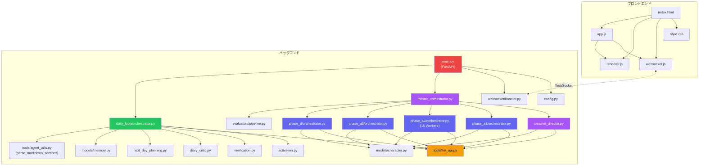

# AIキャラクターストーリー生成システム

> specification_v10.md と script_ai_app_specification_v2.md に基づく、心理学的人格モデルを搭載したキャラクターAI日記生成システム

---

## パート1: アプリシステム概要

### ディレクトリ・ファイル構成

```
AI_character_story_generater/
├── backend/
│   ├── main.py                                # FastAPI エントリポイント (WebSocket + REST API)
│   ├── config.py                              # 設定管理 (APIキー, 4段階プロファイル, モデル定義)
│   ├── agents/
│   │   ├── creative_director/
│   │   │   └── director.py                    # Tier -1: Creative Director (Opus, Self-Critique, Web検索, file_read)
│   │   ├── master_orchestrator/
│   │   │   └── orchestrator.py                # Tier 0: Phase A-1→A-2→A-3→D 順次制御 + Evaluator統合
│   │   ├── phase_a1/
│   │   │   └── orchestrator.py                # Phase A-1: マクロプロフィール (8 Workers, 並列化)
│   │   ├── phase_a2/
│   │   │   └── orchestrator.py                # Phase A-2: ミクロパラメータ 52個 + 規範層 (15 Workers, v2 §6.4.2準拠)
│   │   ├── phase_a3/
│   │   │   └── orchestrator.py                # Phase A-3: 自伝的エピソード (McAdams, redemption bias対策)
│   │   ├── phase_d/
│   │   │   └── orchestrator.py                # Phase D: 7日間イベント列 (28-42件, 2軸メタデータ)
│   │   ├── daily_loop/
│   │   │   ├── orchestrator.py                # Day 1-7 日次ループ (RIM + 内省 + 日記, 自然言語出力)
│   │   │   ├── activation.py                  # パラメータ動的活性化 (5-10個選択, v10 §3.5)
│   │   │   ├── verification.py                # 裏方出力検証 (#1-#52漏洩チェック, v10 §4.6b)
│   │   │   ├── diary_critic.py                # 日記Self-Critic (言語的指紋+AI臭さ検証)
│   │   │   └── next_day_planning.py           # 翌日予定追加 (Stage1+2, protagonist_plan)
│   │   └── evaluators/
│   │       └── pipeline.py                    # Evaluator群7種 (SchemaValidator常時ON, LLM5種)
│   ├── models/
│   │   ├── character.py                       # Pydantic v2 データモデル (v2 §6.3.4準拠スキーマ)
│   │   └── memory.py                          # 記憶・ムード・イベント処理モデル
│   ├── tools/
│   │   ├── llm_api.py                         # LLM API統合ラッパー (Anthropic + Gemini + フォールバック)
│   │   └── agent_utils.py                     # Worker検証 + Markdownセクションパーサー
│   ├── websocket/
│   │   └── handler.py                         # WebSocket接続管理 + 思考ストリーミング
│   ├── reference/                             # 心理学理論参考資料 (Creative Directorのfile_readツール対象)
│   └── storage/character_packages/            # 生成済みパッケージ保存先
├── frontend/
│   ├── index.html                             # メインUI (4画面構成)
│   ├── css/style.css                          # プレミアムダークテーマ
│   └── js/
│       ├── websocket.js                       # WebSocket接続管理 (自動再接続)
│       ├── renderer.js                        # データ → HTML レンダリング
│       └── app.js                             # アプリケーションロジック
├── .env.example                               # 環境変数テンプレート
├── requirements.txt                           # Python依存関係
├── specification_v10.md                       # コア仕様書 (v10)
└── script_ai_app_specification_v2.md          # 脚本AI仕様書 (v2)
```

### モジュール依存関係



> **凡例**: 🟣紫 = Tier -1/0 エージェント、🔵青 = Phase Orchestrators、🟢緑 = 日次ループ、🟡黄 = LLM API、🔴赤 = FastAPI

### プロジェクト要件

| 項目 | 内容 |
|---|---|
| **目的** | サード・インテリジェンス社 Bコースインターン選考課題 |
| **課題** | キャラクターAIに密教学（心理学的人格モデル）を教え、7日間の日記を生成する |
| **理想的最終形** | 1キャラクターの完全な脚本パッケージ（52パラメータ + マクロプロフィール + 自伝的エピソード + 7日間イベント列）を生成し、日次ループで7日間の日記を自動生成 |
| **対象ユーザー** | インターン選考の審査員 |
| **実装対象外** | クローリング（Phase B）、擬似体験（Phase C）、エコーチェンバー |

### 現在のシステム仕様・状態

#### コアロジック・ルール

**4層エージェント階層（Day 0）:**
1. **Tier -1 Creative Director** (Opus): Tool-Callingによる自律推敲ループ。search_web + file_read + request_critique + submit_final_concept の4ツール。Self-Critiqueチェックリスト [A]-[F] の6カテゴリ。
2. **Tier 0 Master Orchestrator** (Opus): Phase A-1→A-2→A-3→D順次制御。各Phase完了後にEvaluator-Optimizerループで即時評価・再生成。
3. **Phase Orchestrators**: 各Phase内のWorker群を管理。A-1=8 Workers、A-2=15 Workers（v2 §6.4.2準拠）、A-3=Planner+Writers、D=5 Workers。
4. **Workers**: プロファイル別モデル（high_quality=sonnet, draft=gemma）。

**Phase A-2 Worker 15分割構成（v2 §6.4.2準拠）:**
```
Step 1: パラメータ Worker 10基を並列実行
  TemperamentWorker_A1 (情動反応系 #1-9)
  TemperamentWorker_A2 (活性・エネルギー系 #10-14)
  TemperamentWorker_A3 (社会的志向系 #15-18)
  TemperamentWorker_A4 (認知スタイル系 #19-23)
  PersonalityWorker_B1 (自己調整・目標追求系 #24-30)
  PersonalityWorker_B2 (対人・社会的態度系 #31-38)
  PersonalityWorker_B3 (経験への開放性系 #39-43)
  PersonalityWorker_B4 (自己概念・実存系 #44-48)
  PersonalityWorker_B5 (ライフスタイル・表出系 #49-50)
  SocialCognitionWorker (対他者認知 #51-52)
Step 2: 規範層 Worker 4基を並列実行
  ValuesWorker (Schwartz 19価値)
  MFTWorker (道徳基盤理論 6基盤)
  IdealOughtSelfWorker (理想自己/義務自己)
  GoalsDreamsWorker (長期・中期目標)
Step 3: CognitiveDerivation (ルールベース自動導出, LLM不使用)
```

**日次ループ（Day 1-7）:**
```
各日のイベント(4-6個) → 動的活性化(5-10パラメータ選択)
→ Perceiver(自然言語出力) → [Impulsive | Reflective](並列, 自然言語出力)
→ 出力検証(#1-#52漏洩チェック)
→ 統合(Higgins): Agentic行動決定(事前シミュレーションツール使用)
→ 情景描写(自然言語出力) → 価値観違反チェック
→ 内省(Self-Perception + 過去統合 + 再解釈, 自然言語出力)
→ 日記生成: Agentic日記執筆(言語的指紋・AI臭さツール検証込み)
→ ムード更新(Peak-End Rule) → key memory抽出 + 記憶圧縮 + 翌日予定追加
→ ムードcarry-over(減衰+閾値リセット)
```

**出力形式の設計原則:**
| 出力の用途 | 形式 | 例 |
|-----------|------|-----|
| システムがプログラム的にパースする値 | JSON | パラメータID、violation_detected(bool)、Tool Calling decision_package |
| エージェント間でプロンプトとして渡すもの | 構造化Markdown/自然言語 | Perceiver出力、Impulsive/Reflective出力、内省メモ、情景描写 |
| 最終出力 | 自然な文章 | 日記、ナラティブ |

**隠蔽原則（implicit/explicit非対称）:**
- Impulsive Agent: 気質・性格層にアクセス可 / 規範層にアクセス不可
- Reflective Agent: 気質・性格層に隠蔽 / 規範層にアクセス可
- 日記生成AI: 気質・性格パラメータを知らない（行動からの推測のみ）

**品質プロファイル別モデル設定:**
| Profile | director_tier | worker_tier | Evaluator | 備考 |
|---------|--------------|-------------|-----------|------|
| high_quality | opus | sonnet | 全7種ON | 本番提出用 |
| standard | sonnet | sonnet | 5種ON | 推奨バランス |
| fast | sonnet | gemini | 3種ON | 素早い確認 |
| draft | sonnet | gemma | 2種ON | 最小コスト |

#### データモデル（v2 §6.3.4準拠拡張済）

| モデル | 用途 | Phase | 拡張フィールド |
|---|---|---|---|
| `ConceptPackage` | キャラクター概念設計 | Tier -1 | psychological_hints(want_and_need, ghost_wound, lie) |
| `MacroProfile` | マクロプロフィール（9セクション） | A-1 | VoiceFingerprint拡張(二人称, 絵文字, 自問頻度, 比喩頻度) |
| `MicroParameters` | 52パラメータ + 規範層 | A-2 | 15 Worker対応サブモデル(SchwartzValuesOutput等) |
| `AutobiographicalEpisodes` | 自伝的エピソード（5-8個） | A-3 | McAdams 5カテゴリ + redemption bias対策 |
| `WeeklyEventsStore` | 7日間イベント列（28-42件） | D | 2軸メタデータ(known/unknown x expectedness) |
| `MoodState` | PAD 3次元ムード | 日次ループ | Peak-End Rule + carry-over |
| `ShortTermMemoryDB` | 記憶（key memory + 段階圧縮） | 日次ループ | LLM段階圧縮(400→200→80→20字) |
| `EventPackage` | 1イベント処理結果 | 日次ループ | 全エージェント出力を包含 |

#### UI/UX

- **フェーズ構成の区分化**: Day 0 ダッシュボード（キャラクター設定結果確認画面）と Day 1-7（日記生成）のシミュレーションループを明確にUI分割。
- **4画面構成**: 起動 → 生成中（思考とフェーズトラッカー） → Day 0結果（6タブ・ダッシュボード） → 履歴
- **生成進行UI（Phase Tracker）**: 生成中画面にて、現在のパイプライン実行状態（Creative Director → A-1 → A-2 → A-3 → D）をステップ形式で可視化。
- **インライン日記生成とキャンセル機能**: 「日記」ダッシュボード内で、他画面に遷移せずインラインで思考ログと生成中の日記をリアルタイム表示。
- **エラー耐性と生成再開（Resume）**: Pydantic v2 の `field_validator` による自己修復 + 各Phase完了ごとのチェックポイント保存。
- **構成設定UI**: 7種のEvaluatorのON/OFFを独立切り替え可能。
- **WebSocket**: エージェント思考のリアルタイム表示。詳細進捗ハートビート。
- **コスト表示**: リアルタイムトークン消費・推定コスト表示。

#### データフロー・永続化仕様

- **インメモリ共有**: 処理途中の全オブジェクト構成はPydanticスキーマによってメモリ上に保たれる
- **MDファイル永続化DB**: キャラクター作成と日次ループ終了後、以下の構造でディスクへ自律保存:
  - `00_profile.md` — キャラクタープロファイル一式
  - `agent_logs.json/.md` — エージェント思考ログ
  - `daily_logs/Day_{N}.md` — 日次ログ（全エージェント出力・ムード変遷・内省・日記・key memory・翌日予定）
  - `checkpoint.json` — 中断再開用チェックポイント

#### エッジケース・制約

- `source: "protagonist_plan"` は Phase D では1件も生成禁止（日次ループの翌日予定追加が唯一の経路）
- redemption bias対策: contamination/loss/ambivalent型が安易な救済で終わることを構造的に防止
- 予想外度分布制約: `low`（予定通り・日常）が各日の半分以上、`high`（強い驚き）は Day 5 以外で各日最大1件

---

## パート2: ベストプラクティス・設計進化

### 1. エージェント階層の設計と評価ループ

**(a) 当初設計**: 仕様書v2の4層階層を採用。評価(EvaluatorPipeline)はすべての生成が終わった最後にまとめて呼び出して成否をテストする想定。
**(b) 変更・根拠**: 全工程終了後のテストでは、例えばPhase A-1（マクロ）で不合格が出た場合、既に無駄に消費したPhase Dまでのトークン生成が全て破棄されるというコスト破壊の問題が存在した。
**(c) 採用プラクティス**: `MasterOrchestrator` の `run()` 内に「Evaluator-Optimizer ループ」を完全統合。各Phase完了直後に即座に評価を挟み、FailならそのPhaseだけを指定回数（最大4回）再生成させる堅牢な自律修正システムへ進化。

### 2. LLM API設計

**(a) 当初設計**: Claude Agent SDK使用を前提。
**(b) 変更・根拠**: SDK未確認のため、直接Anthropic APIおよびGoogle Generative AIに切替。
**(c) 採用プラクティス**: `call_llm()` 統一インターフェースで、実在する最新モデルID（`claude-opus-4-6`等）を直接指定。エラー時にはフォールバックルーティング（Anthropic → Gemini 2.5 Pro）が作動。

### 2b. Gemini 2.5 Proフォールバックの思考トークン対策

**(a) 当初設計**: Claudeと同じ`max_tokens`値をそのままGeminiへ渡していた。`system_prompt`はフォールバック時に`user_message`に文字列結合して渡していた。
**(b) 変更・根拠**: Gemini 2.5 Proは内部で「思考トークン」を使用し、`max_output_tokens`の予算を消費する。例えば`max_tokens=3000`の場合、思考だけで3000トークン全てを使い切り、実際の出力が0トークン（`finish_reason=MAX_TOKENS`）になる問題が発覚。また`system_prompt`を`user_message`に結合する方式ではGeminiの`system_instruction`機能が使われず、指示の分離が機能しなかった。
**(c) 採用プラクティス**: `call_gemma()`でGemini 2.5 Pro検出時に`max_output_tokens`を自動的に4倍（最低16384）に拡張。全tier(opus/sonnet/gemini/gemma)のフォールバックで`system_prompt`を`call_gemma`の`system_prompt`引数として正しく渡すよう修正。

### 3. 隠蔽原則の実装

**(a) 当初設計**: 各エージェントに渡すコンテキストを関数引数レベルで制御
**(b) 採用プラクティス**: 
- Impulsive Agent: 活性化された気質・性格パラメータを直接渡す
- Reflective Agent: 活性化された規範層のみ渡す（気質パラメータは渡さない）
- 日記生成AI: `voice_fingerprint` のみ渡す（パラメータ値は一切渡さない）
- 検証エージェント: パラメータ名・ID (#1-#52) の漏洩をキーワード＋LLMで自動修正

### 4. コアAPI層の自律エージェント化 (Agentic Loops v10)

**(a) 当初設計**: Python側の固定化された順次・反復ループ構造。
**(b) 変更・根拠**: V10仕様書に基づく「真のエージェンティックな振る舞い」を実現するため。
**(c) 採用プラクティス**: Anthropic Tool Calling機能を統合した `call_llm_agentic` インフラを構築し、CreativeDirector、Integration Agent(行動決定)、DiaryGenerationAgentの3コアを Tool-using Autonomous Agent へ置換。

### 5. エージェント出力形式: JSON → 自然言語（構造化Markdown）

**(a) 当初設計**: 全エージェント出力を `json_mode=True` で JSON 形式に統一し、Pydantic モデルで直接パースしていた。
**(b) 変更・根拠**: JSON形式はシステムが値をプログラム的に処理する場面でのみ有効。エージェントがプロンプトとして受け取る記憶・ナラティブ・内省・情景描写等は、自然言語のほうがLLMの処理品質が高い。日記や情景描写にJSON制約を課すと文学的品質が大幅に低下する。
**(c) 採用プラクティス**: 
- **JSON維持**: DynamicActivation(パラメータID)、ValuesViolation(bool判定)、Tool Calling(decision_package)
- **自然言語化**: Perceiver、Impulsive、Reflective、SceneNarration、Introspectionの5エージェント出力を `## セクション名` 形式のMarkdownに変更
- `parse_markdown_sections()` ユーティリティで各セクションをPydanticモデルのフィールドに分配
- 統合エージェントへの入力も `json.dumps(model.model_dump())` から自然言語テキストに変更

### 6. Phase A-2 Worker 細分化

**(a) 当初設計**: MVP段階では4つの統合Worker（気質全部、性格全部、対他者認知、規範層）で実行。
**(b) 変更・根拠**: v2 §6.4.2 で15 Workerへの分割が明確に規定。単一LLMが52パラメータを一度に生成するとコンテキスト負荷で品質が低下し、一部再生成も困難。
**(c) 採用プラクティス**: v10 §3.3のカテゴリ分類（A1-A4, B1-B5）に沿って10パラメータWorker + 4規範層Worker + 1ルールベース導出の計15 Workerに分割。Step 1(10並列) → Step 2(4並列) → Step 3(逐次) の3段階で実行。

### 7. WebサーチおよびMDファイル保存ルーティング

**(a) 当初設計**: データ出力はJSONオブジェクトやインメモリ保持に留まっていた。
**(b) 変更・根拠**: 世界観に深みを持たせるリサーチ能力と、人間可読なMD永続化が必要。
**(c) 採用プラクティス**: 
- Creative Directorに `search_web` + `file_read`（backend/reference/参照）の2ツールを付与。
- `md_storage.py` で全エージェント出力・ムード変遷・内省・日記・key memoryを含む完全なDay_N.mdを自動生成。

---

## パート3: プロジェクト管理

### 現在のフェーズ

| ステージ | 状態 | 備考 |
|---|---|---|
| Stage 1: MVP | ✅ 実装完了 | 4層エージェント構造、日次ループ統合済 |
| Stage 2: 品質向上 | ✅ 実装完了 | Evaluator群7種、再生成ループ統合完了 |
| Stage 3: エージェント自律化 | ✅ 実装完了 | コア3種(Director, Action, Diary)のTool-Using化 |
| Stage 4: UX改善 | ⬜ 未着手 | 共同編集モード（v2 §3.4）|
| Stage 5: インフラ・完成 | ✅ 実装完了 | Webサーチ・MD永続化・E2Eテスト済 |
| Stage 6: 仕様書完全準拠 | ✅ 実装完了 | バグ修正、A-2 15Worker化完了 |
| Stage 7: 監査・運用保守 | ✅ 実装完了 | 全エージェントプロンプトの抽出・構造化レポート作成 |

### 次のアクション

1. **E2Eテスト実行** → draftプロファイルでキャラクター生成 + 日記生成を通しで実行し、全パイプラインの動作を確認する
2. **提出用キャラクター生成** → High Qualityプロファイルで全EvaluatorをONにし、MDデータベース出力まで通して実行する
3. **Phase A-1 Workerプロンプト更新** → 追加されたMacroProfileフィールド（second_person_by_context, emoji_usage等）を生成するようWorkerプロンプトを拡充する

### ブロッカー

> [!WARNING]
> - Anthropic APIのクレジット残高不足により全Claude呼び出しがGemini 2.5 Proへフォールバック中。本稼働時は有償Tierキーが必要。
> - Gemini 2.5 Proの思考トークン問題（`max_output_tokens`枯渇による空レスポンス）は修正済み（`max_output_tokens`自動4倍拡張 + `system_prompt`の正しいパススルー）。
