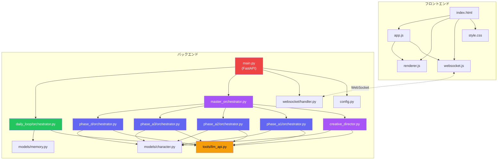

# AIキャラクターストーリー生成システム

> specification_v10.md と script_ai_app_specification_v2.md に基づく、心理学的人格モデルを搭載したキャラクターAI日記生成システム

---

## パート1: アプリシステム概要

### ディレクトリ・ファイル構成

```
AI_character_story_generater/
├── backend/
│   ├── main.py                                # FastAPI エントリポイント (WebSocket + REST API)
│   ├── config.py                              # 設定管理 (APIキー, プロファイル, モデル定義)
│   ├── agents/
│   │   ├── creative_director/
│   │   │   └── director.py                    # Tier -1: Creative Director (Opus, Self-Critique)
│   │   ├── master_orchestrator/
│   │   │   └── orchestrator.py                # Tier 0: Phase A-1→A-2→A-3→D 順次制御
│   │   ├── phase_a1/
│   │   │   └── orchestrator.py                # Phase A-1: マクロプロフィール (8 Workers)
│   │   ├── phase_a2/
│   │   │   └── orchestrator.py                # Phase A-2: ミクロパラメータ 52個 + 規範層
│   │   ├── phase_a3/
│   │   │   └── orchestrator.py                # Phase A-3: 自伝的エピソード (McAdams)
│   │   ├── phase_d/
│   │   │   └── orchestrator.py                # Phase D: 7日間イベント列 (28-42件)
│   │   ├── daily_loop/
│   │   │   └── orchestrator.py                # Day 1-7 日次ループ (RIM + 内省 + 日記)
│   │   └── evaluators/                        # Evaluator群 (Stage 2で実装予定)
│   ├── models/
│   │   ├── character.py                       # Pydantic v2 データモデル (脚本パッケージ)
│   │   └── memory.py                          # 記憶・ムード・イベント処理モデル
│   ├── tools/
│   │   └── llm_api.py                         # LLM API統合ラッパー (Anthropic + Gemma)
│   ├── websocket/
│   │   └── handler.py                         # WebSocket接続管理 + 思考ストリーミング
│   ├── schemas/                               # JSON Schema (今後定義)
│   ├── reference/                             # 心理学理論参考資料 (今後追加)
│   └── storage/character_packages/            # 生成済みパッケージ保存先
├── frontend/
│   ├── index.html                             # メインUI (4画面構成)
│   ├── css/style.css                          # プレミアムダークテーマ
│   └── js/
│       ├── websocket.js                       # WebSocket接続管理 (自動再接続)
│       ├── renderer.js                        # データ → HTML レンダリング
│       └── app.js                             # アプリケーションロジック
├── .env.example                               # 環境変数テンプレート
├── .gitignore
├── requirements.txt                           # Python依存関係
├── specification_v10.md                       # コア仕様書 (v10)
└── script_ai_app_specification_v2.md          # 脚本AI仕様書 (v2)
```

### モジュール依存関係



> **凡例**: 🟣紫 = Tier -1/0 エージェント、🔵青 = Phase Orchestrators、🟢緑 = 日次ループ、🟡黄 = LLM API、🔴赤 = FastAPI

### プロジェクト要件

| 項目 | 内容 |
|---|---|
| **目的** | サード・インテリジェンス社 Bコースインターン選考課題 |
| **課題** | キャラクターAIに密教学（心理学的人格モデル）を教え、7日間の日記を生成する |
| **理想的最終形** | 1キャラクターの完全な脚本パッケージ（52パラメータ + マクロプロフィール + 自伝的エピソード + 7日間イベント列）を生成し、日次ループで7日間の日記を自動生成 |
| **対象ユーザー** | インターン選考の審査員 |
| **実装対象外** | クローリング（Phase B）、擬似体験（Phase C）、エコーチェンバー |

### 現在のシステム仕様・状態

#### コアロジック・ルール

**4層エージェント階層（Day 0）:**
1. **Tier -1 Creative Director** (Opus 4.6): concept_package生成 + Self-Critique最大4回
2. **Tier 0 Master Orchestrator** (Opus 4.6): Phase A-1→A-2→A-3→D順次制御
3. **Phase Orchestrators**: 各Phase内のWorker群を管理
4. **Workers** (Gemma 4 / Sonnet): 個別生成タスク

**日次ループ（Day 1-7）:**
```
各日のイベント(4-6個) → Perceiver → [Impulsive | Reflective](並列)
→ 統合(Higgins) → 情景描写 → 価値観違反チェック → 行動バッファ蓄積
→ 内省(Self-Perception + 過去統合 + 再解釈)
→ 日記生成(言語的指紋 + 省略制御)
→ key memory抽出 + 記憶圧縮 + 翌日予定追加
```

**隠蔽原則（implicit/explicit非対称）:**
- Impulsive Agent: 気質・性格層にアクセス可 / 規範層にアクセス不可
- Reflective Agent: 気質・性格層に隠蔽 / 規範層にアクセス可
- 日記生成AI: 気質・性格パラメータを知らない（行動からの推測のみ）

#### データモデル

| モデル | 用途 | Phase |
|---|---|---|
| `ConceptPackage` | キャラクター概念設計 | Tier -1 |
| `MacroProfile` | マクロプロフィール（8セクション） | A-1 |
| `MicroParameters` | 52パラメータ + 規範層 | A-2 |
| `AutobiographicalEpisodes` | 自伝的エピソード（5-8個） | A-3 |
| `WeeklyEventsStore` | 7日間イベント列（28-42件） | D |
| `MoodState` | PAD 3次元ムード | 日次ループ |
| `ShortTermMemoryDB` | 記憶（key memory + 段階圧縮） | 日次ループ |
| `EventPackage` | 1イベント処理結果 | 日次ループ |

#### UI/UX

- **4画面構成**: 起動 → 生成中（思考ストリーミング） → 結果（6タブ） → 履歴
- **WebSocket**: エージェント思考のリアルタイム表示
- **デザイン**: プレミアムダークテーマ（glassmorphism + gradient accents）
- **コスト表示**: リアルタイムトークン消費・推定コスト表示

#### エッジケース・制約

- `source: "protagonist_plan"` は Phase D では1件も生成禁止（日次ループの翌日予定追加が唯一の経路）
- redemption bias対策: contamination/loss/ambivalent型が安易な救済で終わることを構造的に防止
- 予想外度分布制約: `high` が半分以上、`low` は Day 5 以外で各日最大1件

---

## パート2: ベストプラクティス・設計進化

### 1. エージェント階層の設計

**(a) 当初設計**: 仕様書v2の4層階層をそのまま採用
**(b) 変更・根拠**: MVP段階ではPhase Orchestrator + Worker分離を一部簡略化（Phase A-2のWorker統合実行）。コスト効率のため。
**(c) 採用プラクティス**: Phase Orchestrator内にWorker呼び出しロジックを直接実装し、ファイル分割よりも実行効率を優先。本番品質ではWorker分離を完全実装。

### 2. LLM API設計

**(a) 当初設計**: Claude Agent SDK使用を前提
**(b) 変更・根拠**: SDK未確認のため、直接Anthropic API呼び出しに切替。Prompt Caching（`cache_control: ephemeral`）を手動で制御可能にする利点もある。
**(c) 採用プラクティス**: `call_llm()` 統一インターフェースで `tier="opus"|"sonnet"|"gemma"` を指定。内部で自動的にモデル・API・キャッシュ制御を切替。

### 3. 隠蔽原則の実装

**(a) 当初設計**: 各エージェントに渡すコンテキストを関数引数レベルで制御
**(b) 採用プラクティス**: 
- Impulsive Agent: `micro_parameters.temperament` を直接渡す
- Reflective Agent: `schwartz_values`, `ideal_self`, `ought_self` のみ渡す（気質パラメータは渡さない）
- 日記生成AI: `voice_fingerprint` のみ渡す（パラメータ値は一切渡さない）

---

## パート3: プロジェクト管理

### 現在のフェーズ

| ステージ | 状態 | 備考 |
|---|---|---|
| Stage 1: MVP | ✅ 構造完了 | APIキー設定後にE2Eテスト可能 |
| Stage 2: 品質向上 | ⬜ 未着手 | Evaluator群の実装 |
| Stage 3: UX改善 | ⬜ 未着手 | 共同編集・ストリーミング強化 |
| Stage 4: 提出準備 | ⬜ 未着手 | 説明資料・比較実験 |

### 次のアクション（優先順）

1. **`.env` ファイルにAPIキーを設定** → E2Eテスト実行可能に
2. **Draftプロファイルで1キャラクター生成テスト** → 各Phase出力の品質確認
3. **翌日予定追加エージェント実装** → Day間の連続性強化
4. **Stage 2 Evaluator実装** → SchemaValidator, BiasAuditor
5. **提出用キャラクター生成** → High Qualityプロファイルで最終生成

### ブロッカー

> [!WARNING]
> **Anthropic APIキーと Google AI Studio APIキーが未設定**。`.env` ファイルを作成し、APIキーを設定しないと生成テストを実行できません。
