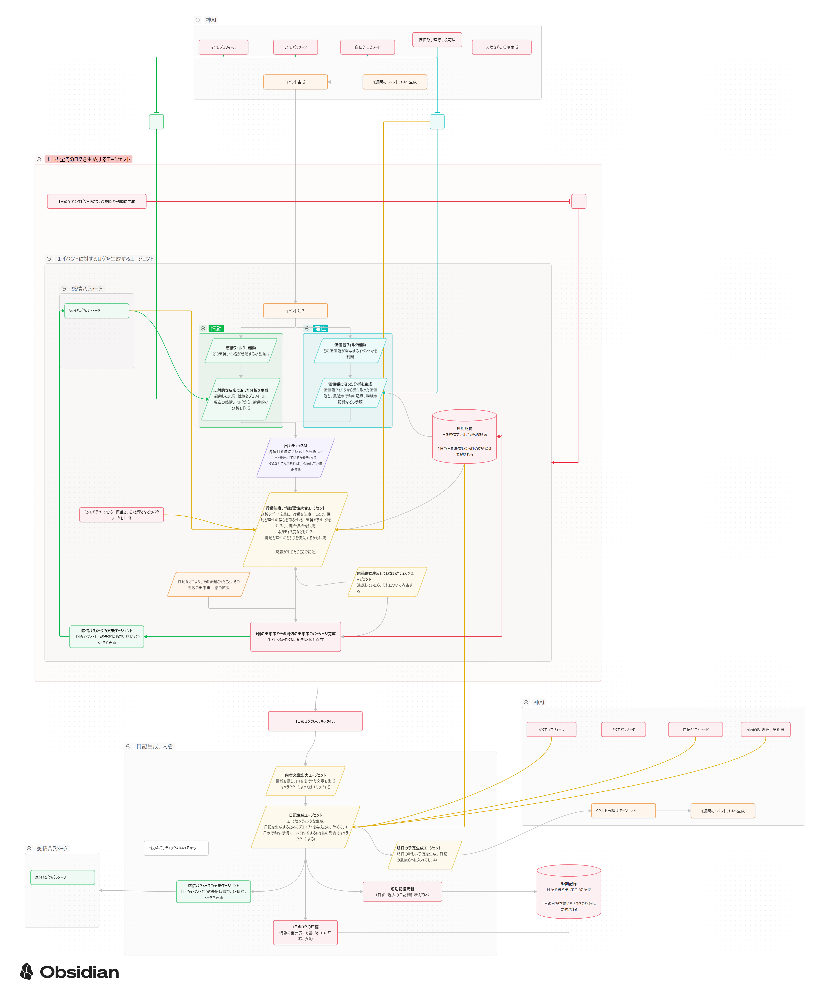

# AI Character Story Generator

心理学的人格モデルに基づくキャラクターを自動生成し、そのキャラクターの視点で日記を書くマルチエージェントAIシステム。

複数のAIエージェントが階層的に協調し、キャラクターの性格設計 → 世界観構築 → イベント生成 → 日記執筆までを一貫して行います。



## Features

- **心理学ベースのキャラクター生成** — Big Five性格特性・価値観・動機付けモデルに基づく深みのあるキャラクター設計
- **4層マルチエージェントアーキテクチャ** — Creative Director → Master Orchestrator → Phase Orchestrators → Workers の階層構造
- **6段階の品質評価パイプライン** — Schema Validator, Consistency Checker, Bias Auditor, Interestingness Evaluator 等による多角的品質保証
- **リアルタイム思考ストリーミング** — WebSocketによるエージェントの思考過程のライブ表示
- **マルチLLMサポート** — Claude (Opus/Sonnet), Gemini をタスク粒度で使い分け
- **品質プロファイル切替** — `high_quality` / `standard` / `fast` / `draft` の4段階プリセット

## Architecture

```
Tier -1: Creative Director (総監督)
    └── Tier 0: Master Orchestrator (統括指揮)
            ├── Phase A-1: キャラクター基盤設計
            │     └── Workers: 性格特性、価値観、背景設定...
            ├── Phase A-2: 世界観・環境構築
            │     └── Workers: 時代設定、地理、社会構造...
            ├── Phase A-3: 人間関係・イベント設計
            │     └── Workers: 関係性マップ、イベント生成...
            └── Phase D: 日記生成
                  └── Workers: 文体設計、日記執筆、校正...

Evaluators (横断的品質評価):
    ├── Schema Validator       — 構造整合性チェック
    ├── Consistency Checker    — 設定間の矛盾検出
    ├── Bias Auditor           — バイアス・ステレオタイプ検出
    ├── Interestingness Eval   — 物語の面白さ評価
    ├── Distribution Validator — パラメータ分布の偏り検出
    └── Narrative Connection   — 物語的つながりの評価
```

## Tech Stack

| Layer | Technology |
|-------|-----------|
| Backend | Python 3.11+, FastAPI, WebSocket |
| Frontend | Vanilla JS, CSS (SPA) |
| LLM | Claude Opus 4.6 / Sonnet 4.6, Gemini 2.5 Pro |
| Data | Pydantic v2, Markdown永続化 |
| Search | DuckDuckGo Search API (リサーチ用) |

## Quick Start

### Prerequisites

- Python 3.11+
- Anthropic API Key (必須)
- Google AI API Key (Gemini使用時のみ)

### Installation

```bash
# リポジトリをクローン
git clone https://github.com/menma22/AI_character_story_generater.git
cd AI_character_story_generater

# 依存パッケージをインストール
pip install -r requirements.txt

# 環境変数を設定
cp .env.example .env
# .env を編集して API キーを入力
```

### Run

```bash
# サーバー起動
python -m uvicorn backend.main:app --host 0.0.0.0 --port 8001

# ブラウザで http://localhost:8001 を開く
```

## Usage

1. ブラウザで `http://localhost:8001` にアクセス
2. 画面右上の設定ボタンからAPIキーを入力（フロントエンドからも設定可能）
3. キャラクターの基本条件（名前・年齢・性別など）を入力
4. 品質プロファイルを選択（`draft` で高速生成、`high_quality` で最高品質）
5. 生成を開始すると、エージェントの思考過程がリアルタイムで表示される
6. 完了後、生成されたキャラクターシートと日記が表示される

## Quality Profiles

| Profile | Director Model | Worker Model | 評価AI | 想定用途 |
|---------|---------------|-------------|--------|---------|
| `high_quality` | Opus | Sonnet | 全6種有効 | 本番・デモ |
| `standard` | Sonnet | Sonnet | 5種有効 | 通常利用 |
| `fast` | Sonnet | Gemini | 3種有効 | 高速プロトタイプ |
| `draft` | Sonnet | Gemini | 最小限 | 開発・テスト |

## Project Structure

```
.
├── backend/
│   ├── main.py                  # FastAPI エントリポイント
│   ├── config.py                # 設定・品質プロファイル管理
│   ├── agents/
│   │   ├── creative_director/   # Tier-1: 総監督エージェント
│   │   ├── master_orchestrator/ # Tier0: 統括指揮エージェント
│   │   ├── phase_a1/            # キャラクター基盤設計
│   │   ├── phase_a2/            # 世界観・環境構築
│   │   ├── phase_a3/            # 人間関係・イベント設計
│   │   ├── phase_d/             # 日記生成
│   │   ├── daily_loop/          # デイリーループ制御
│   │   └── evaluators/          # 品質評価パイプライン
│   ├── models/                  # Pydantic データモデル
│   ├── schemas/                 # JSON Schema 定義
│   ├── storage/                 # Markdown 永続化
│   ├── tools/                   # LLM API / ユーティリティ
│   └── websocket/               # WebSocket ハンドラ
├── frontend/
│   ├── index.html               # SPA エントリポイント
│   ├── js/                      # アプリロジック・WebSocket・レンダラ
│   └── css/                     # スタイルシート
├── docs/                        # ドキュメント・図
├── requirements.txt
├── .env.example
└── README.md
```

## Development

```bash
# テスト実行
python -m pytest

# ログ確認
tail -f app.log
```

## License

MIT

## Contributing

Issue・Pull Request を歓迎します。バグ報告や機能提案は [Issues](https://github.com/menma22/AI_character_story_generater/issues) からどうぞ。
